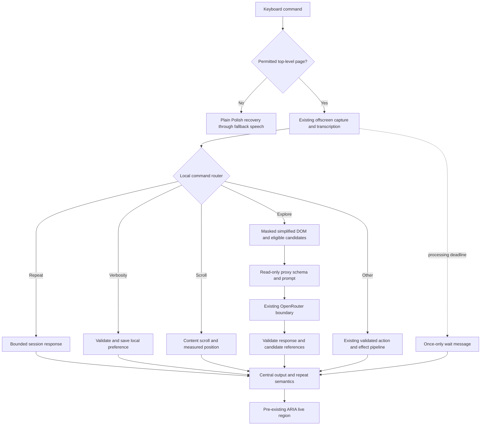

# Phase 3: Page Exploration & Conversation — Research

**Researched:** 2026-10-03
**Domain:** Chrome MV3 page access, Polish conversational commands, ephemeral output state, bounded model responses
**Confidence:** MEDIUM (official documentation checked; browser and assistive-technology acceptance remains necessary)

## User Constraints

No phase CONTEXT was supplied. The orchestrator records explicit authorization to research and plan without it. There are **no invented phase-specific locked decisions**. Recommendations below are planning proposals, not records of user decisions. [VERIFIED: invocation; init.phase-op 3]

Retain the existing TypeScript/esbuild MV3 extension and Python FastAPI/httpx proxy, Polish user messages, English code, source masking, local action validation, backend-only API keys, and minimal dependencies. Phase 3 depends on Phase 1 only; do not require Phase 2 confirmation flows or implement Phase 4 settings/audio controls. [VERIFIED: .planning/PROJECT.md:63-73; .planning/ROADMAP.md:64-95]

Phase 1 implementation exists, but its genuine screen-reader, microphone, live-provider and live-site acceptance is still pending. Do not turn historical automated results into human acceptance evidence. [VERIFIED: .planning/REQUIREMENTS.md:8; .planning/STATE.md:1-38]

## Summary

Use a deterministic local command router after transcription. Repeat, verbosity and scrolling should complete without a model request; exploration should have a dedicated read-only proxy contract. Preserve the existing action pipeline for all other utterances. This isolates Phase 3 from the action-policy work in Phase 2 and prevents an exploration request from producing a click. This is an architectural recommendation grounded in the current separate action/effect pipeline and fail-closed executor. [VERIFIED: extension/src/background/pipeline.ts:125-166; extension/src/content/executor.ts:9-52]

The main gaps are permissions, output semantics and lifecycle: the current extension starts only on InPost/fixtures; routine messages would overwrite a naive repeat buffer; service-worker globals do not survive termination; the current transcription and model calls can outlast the requested wait threshold. Chrome supports temporary access after a keyboard command, durable local settings and memory-only session storage. [VERIFIED: extension/src/background/pipeline.ts:30-41,71-117; extension/src/offscreen/offscreen.ts:29-45] [CITED: https://developer.chrome.com/docs/extensions/develop/concepts/activeTab] [CITED: https://developer.chrome.com/docs/extensions/reference/api/storage] [CITED: https://developer.chrome.com/docs/extensions/develop/concepts/service-workers/lifecycle]

**Primary recommendation:** Build three cohesive units: conversation/output lifecycle; permitted-page exploration and deterministic scroll; integrated adversarial/browser and human acceptance. Deliver full MVP behavior, not another walking skeleton. Proposed product semantics needing explicit plan documentation are listed in the Assumptions Log.

## Architectural Responsibility Map

The ownership below is a recommendation following the existing boundaries: capture in an offscreen document, orchestration in the worker, page access in content, model access in the proxy. [VERIFIED: extension/src/offscreen/offscreen.ts:29-45; extension/src/background/pipeline.ts:125-166; extension/src/content/index.ts:10-37; server/app/main.py:66-111]

| Capability | Primary tier | Secondary tier | Rationale |
|---|---|---|---|
| Recognize small conversational commands | Extension service worker | Shared pure functions | Route the transcript before requesting page data/model work |
| Summarize page | API/backend | Content snapshot + worker | Backend owns prompt/schema; browser supplies masked evidence |
| List available actions | Content policy/candidate projection | Backend ranks; worker renders | Local executability must constrain model suggestions |
| Scroll and measure result | Browser/content | Worker owns turn | Only the page can measure actual scroll movement |
| Repeat | Worker + session storage | Content ARIA output | Keep one bounded response for the current page context |
| Verbosity | Worker + local storage | Backend prompt/renderer | Persist only the preference, not conversational data |
| Wait/errors | Worker lifecycle | Offscreen events, content delivery/TTS fallback | One owner for deadline and terminal cleanup |

<phase_requirements>
## Phase Requirements

Verbatim requirement descriptions; source markers delimit copied project data. [VERIFIED: .planning/REQUIREMENTS.md:24-41]

<!-- DATA_f9c042a7_START -->
| ID | Description | Research support |
|---|---|---|
| PAGE-02 | User can ask "co tu jest?" and hears a 1–2 sentence page summary | Read-only endpoint, bounded sentence output, masked snapshot |
| PAGE-03 | User can ask "co mogę zrobić?" and hears at most 3–5 available actions | Locally eligible candidates, model ranking, enforced item cap |
| ACT-03 | User can scroll up, down and to the top | Local direction parser, content scroll, measured outcome |
| OUT-03 | User can say "powtórz" to hear the last message again | Substantive-message buffer, same-page scope, identical ARIA mutations |
| OUT-04 | User can say "krócej" or "dokładniej" to change verbosity (3 levels, remembered across sessions) | Three-valued local preference, saturation, shared renderer policy |
| OUT-07 | If a command takes longer than ~8 s, user hears "To trwa dłużej niż zwykle" | Processing-start deadline, once-only notification, handoff cleanup |
| OUT-08 | Every error is spoken plainly with a suggested next step (STT failure, network failure, model failure, element not found). Never silence | Classified failures, complete local messages, terminal boundary |
<!-- DATA_f9c042a7_END -->
</phase_requirements>

## Project Constraints (from project instructions)

The root AGENTS file was not found by the explicit existence probe; no project skill directories were found in either supported local location. The agent-skills mapping is empty. Instructions instead come from the two CLAUDE documents and project decisions. The workflow mandate is already satisfied by this delegated GSD planning run. [VERIFIED: session filesystem probes; .planning/config.json:89-96; .claude/CLAUDE.md:274-287]

- Preserve irreversible-action confirmation/refusal, sensitive-field masking, no passwords/OTP/captcha automation, and asking instead of guessing. A read-only feature must never relax action policy. [VERIFIED: CLAUDE.md:25-37]
- Send simplified DOM rather than full HTML/screenshots; keep API keys outside the extension/repository; do not log page or command content except explicitly enabled local debugging. [VERIFIED: CLAUDE.md:33-37]
- Keyboard and screen-reader access are required; never communicate only visually; actual NVDA or VoiceOver testing is needed before claiming a new UI ready. [VERIFIED: CLAUDE.md:39-44]
- Speak short plain Polish, announce actions before effects, and give a next step with errors. Routine progress should not dominate substantive responses. [VERIFIED: CLAUDE.md:46-55]
- Follow existing style, avoid unnecessary dependencies/scope expansion, and check every action change against safety rules. Keep code/comments/commits English and user output Polish; the later confirmed project decision resolves the older provisional wording. [VERIFIED: CLAUDE.md:93-115; .planning/PROJECT.md:65-73]
- Keep the implementation within GSD and preserve unrelated work, including the existing untracked teammate TTS directory. Do not commit in this research assignment. [VERIFIED: .claude/CLAUDE.md:274-287; invocation; git status probe]

The older embedded stack research contains superseded JavaScript/Hono guidance. Follow its explicit TypeScript/Python override and the actual implementation. Do not adopt its older Chrome minimum as a tested requirement. [VERIFIED: .claude/CLAUDE.md:29-36; extension/static/manifest.json:7]

## Standard Stack

**Retain the locked baseline; do not upgrade for this phase.** These are repository declarations, not claims of newest registry versions or a fresh package-legitimacy audit. [VERIFIED: extension/package.json:12-16; server/uv.lock:64-77,103-114,166-177,265-277,340-351]

<!-- DATA_7da10a58_START -->
| Component | Exact source values | Purpose |
|---|---|---|
| MV3 | `"manifest_version": 3`, `"minimum_chrome_version": "116"` | Existing declared platform; validate actual demo/browser behavior separately |
| TypeScript/esbuild | `"typescript": "7.0.2"`, `"esbuild": "0.28.2"` | Existing compiler and bundler |
| Type declarations | `"@types/chrome": "0.3.4"`, `"@types/node": "26.6.4"` | Existing development dependencies |
| FastAPI | `name = "fastapi"`, `version = "0.142.2"` | Existing proxy; lock records upload date 2026-09-30 |
| HTTPX | `name = "httpx"`, `version = "0.28.1"` | Existing shared upstream client; lock records upload date 2024-12-06 |
| Pydantic | `name = "pydantic"`, `version = "2.13.5"` | Existing transitive schema validator; lock records upload date 2026-08-28 |
| Uvicorn/pytest | `name = "uvicorn"`, `version = "0.54.0"`; `name = "pytest"`, `version = "9.1.1"` | Existing runtime/test runner |
<!-- DATA_7da10a58_START_END -->

Sources for the manifest row: [VERIFIED: extension/static/manifest.json:2-7]. Other rows: [VERIFIED: extension/package.json:12-16; server/uv.lock:64-77,103-114,166-177,265-277,340-351]. Installation is environment restoration using existing lockfiles, not package selection. No new SDK, state library, scrolling library, browser harness or schema dependency is warranted.

### Package Legitimacy Audit

No new external packages are recommended. No registry-newest or registry-legitimacy claim is made. The install gate applies if an executor introduces a new package; this research does not authorize one. Current package source/version evidence is the existing manifests/locks above. Restore these without regenerating locks; dependency availability still needs validation on the execution machine.

### Alternatives considered

| Choice | Strongest alternative | Recommendation |
|---|---|---|
| User-invoked temporary page access | Static access to every web page makes cross-navigation reinjection simpler | Use temporary access; it matches explicit PTT interaction and reduces unrelated-site access |
| Read-only exploration endpoint | Extend the existing action response with exploration variants | Keep the mutation contract unchanged to avoid Phase 2 overlap and accidental actions |
| Local repeat/verbosity/scroll routing | One model interprets every command | Keep the finite grammar deterministic; these commands do not need semantic planning |
| Session replay + local preference | Durable conversation history | Persist only the preference; replay text is page-derived data |

These tradeoffs are recommendations based on the permission/storage documentation and current action architecture, not user-locked choices. [CITED: https://developer.chrome.com/docs/extensions/develop/concepts/activeTab] [CITED: https://developer.chrome.com/docs/extensions/reference/api/storage] [VERIFIED: server/app/schemas.py:7-38]

## Architecture Patterns

### System architecture diagram

Proposed control flow; new component labels are design recommendations, not existing identifiers.



### 1. Permission-aware access, not an InPost-only rename

The present declaration is narrow and the worker also rejects other origins. Exact evidence: [VERIFIED: extension/static/manifest.json:13-31; extension/src/background/pipeline.ts:30-34]

<!-- DATA_530df2b8_START -->
```text
"permissions": ["offscreen", "storage", "tts"]
"https://inpost.pl/*"
"https://www.inpost.pl/*"
"__PROXY_ORIGIN__/fixtures/*"
return ['https://inpost.pl', 'https://www.inpost.pl'].includes(u.origin) || (u.origin === new URL(__PROXY_URL__).origin && u.pathname.startsWith('/fixtures/'));
```
<!-- DATA_530df2b8_END -->

The permissions line above condenses source formatting; values are unchanged. Add temporary active-tab access and the scripting permission; on an actual keyboard invocation, ping the top frame, inject the existing bundled content script if absent, then ping again before recording. Keep the existing idempotence guard and static InPost/fixture injection. Retain the proxy-only network host permission. Chrome documents keyboard commands as a granting gesture; injection requires scripting plus a host grant. Cross-origin navigation revokes the temporary grant; restricted browser pages stay inaccessible. [CITED: https://developer.chrome.com/docs/extensions/develop/concepts/activeTab] [CITED: https://developer.chrome.com/docs/extensions/reference/api/scripting] [VERIFIED: extension/src/content/index.ts:7-10]

Define MVP coverage as user-invoked ordinary top-level HTTP(S) documents. Unsupported pages get a Polish explanation and an instruction to open a normal page. Do not promise PDFs, browser internal pages, closed shadow roots or cross-origin embedded applications. The current walker explicitly skips frames/canvas and traverses available shadow roots; it cannot establish complete understanding of those surfaces. [ASSUMED: A1 scope proposal] [VERIFIED: extension/src/content/snapshot.ts:14,195-197]

Catch malformed/missing URLs and injection rejection. Do not record audio only to discover the page is inaccessible. Keep all later work bound to the original tab/document, not whichever tab becomes active. For a new document, reinject on the next explicit command. Preserve existing InPost navigation-effect handling; general cross-site post-click effect recovery is not a prerequisite for read-only exploration. [VERIFIED: extension/src/background/pipeline.ts:195-216; extension/src/shared/turn.ts:5-9]

### 2. Local command routing before snapshot/model work

Normalize whitespace, casing and terminal punctuation, then match complete small phrases for repeat, verbosity, exploration and scroll. Use explicit aliases and tests, not substring matching: dictating text containing the word for repeat must remain a fill request. Route recognized conversation commands before acquiring a snapshot; replay and preference changes need no DOM serialization. Unknown utterances continue through the existing validated action route. [ASSUMED: A2 grammar proposal]

Separate scrolling from model action proposals. Existing action contracts remain exactly: [VERIFIED: server/app/schemas.py:10-17,33-38; extension/src/shared/validate.ts:3-6]

<!-- DATA_732610c9_START -->
```text
"enum": ["click", "fill", "none"]
action: Literal["click", "fill", "none"]
export type Verdict = { ok: true; kind: 'click' | 'fill' | 'none' } | { ok: false; reason: RejectReason };
```
<!-- DATA_732610c9_END -->

Add a distinct typed scroll message/result and read-only exploration request/response; do not reinterpret an existing action field as a direction. Validate incoming runtime payloads at the receiver. Keep sender, top-frame, turn and document checks; when touching offscreen dispatch, ensure a content-script sender cannot impersonate the offscreen document merely by carrying the right extension ID. Current dispatch checks the ID and payload, whereas tab-bound execution checks more ownership information. [VERIFIED: extension/src/background/index.ts:6-12; extension/src/background/pipeline.ts:168-176]

### 3. Read-only exploration contract and honest available actions

Proposed new route and identifiers, not existing values: a single exploration endpoint with a summary/actions mode and the validated verbosity preference. Its response should contain a bounded array of summary sentences and a bounded array of candidate IDs; only the relevant array is populated. Define matching TS/Pydantic/provider schemas together. Keep strict extra-field rejection and verify the browser's runtime response too. Pydantic output validation already occurs explicitly before sending responses; preserve that error mapping. [ASSUMED: A3 contract proposal] [VERIFIED: server/app/main.py:66-92; server/app/schemas.py:21-38] [CITED: https://fastapi.tiangolo.com/tutorial/response-model/]

Summary: request one or two complete Polish sentences grounded only in masked page title, headings and main text. Reject malformed output, empty output and excessive arrays; do not merely slice a sentence halfway through. Report an empty/unreadable/truncated snapshot honestly. Do not claim absence of a control from a partial snapshot. Current snapshot limits are exactly: [VERIFIED: extension/src/shared/snapshot-format.ts:4,9,36]

<!-- DATA_1f7b062d_START -->
```text
export interface Snapshot { epoch: number; path: string; title: string; nodes: SnapNode[]; truncated: boolean }
export const MAX_NODES = 250, MAX_TEXT = 120, MAX_ALERT = 160;
if (s.truncated) lines.push('[snapshot truncated]');
```
<!-- DATA_1f7b062d_END -->

Actions: compute a local eligible candidate set using the existing live policy, excluding disabled, sensitive and currently refused controls. Send only those masked candidates for ranking. Require returned IDs to be a unique subset, retain their associated local operation, and render Polish action phrases from the validated names. Recheck document/epoch and candidate eligibility before presenting them if the page changed during the model request. Never execute the suggested IDs or reuse them as authorization on a later command. If fewer eligible actions exist, list the real count; never invent enough entries to reach three. [ASSUMED: A3 contract proposal] [VERIFIED: extension/src/content/snapshot.ts:272-280; extension/src/shared/validate.ts:14-33]

For fills, candidate policy must test field eligibility without inventing arbitrary user text just to pass the action validator. Extract/reuse target-policy logic or add a pure candidate projection beside it. Do not fork a permissive second safety policy. The current validator requires nonempty fill text and enforces sensitivity and field length. [VERIFIED: extension/src/shared/validate.ts:24-30]

Retain one completion per exploration request, model pinning, bounded tokens, provider strict schema, local validation, request-body guards, fenced page data and no body logging. Do not add conversation history, page fetches by URL or a model SDK. OpenRouter schema support is provider/model-specific; a schema is not proof that generated prose is true. [VERIFIED: server/app/openrouter.py:16-48; server/app/prompts.py:26-36; server/app/main.py:48-60] [CITED: https://openrouter.ai/docs/guides/features/structured-outputs]

### 4. Repeat and verbosity have different storage lifetimes

Use a central output function with explicit substantive/status/replay intent. Save only successfully delivered final answers, meaningful refusals and recoverable errors. Exclude listening, processing, busy, wait notices and action pre-announcements. Replay reads the saved response without model work or another page snapshot and never overwrites itself. An empty buffer produces a helpful Polish response. This prevents the recording lifecycle from destroying what the user intended to repeat. [ASSUMED: A4 repeat semantics] [VERIFIED: extension/src/background/pipeline.ts:104-112; extension/src/shared/messages.pl.ts:3-5]

Keep one bounded entry per tab/document in session storage; clear it on tab close and document change, and let browser restart/extension reload clear it naturally. A result delivered after a navigation belongs to the destination document. Never store transcripts, audio, snapshots or replay text in durable preferences. Session storage survives worker restarts but is cleared on browser restart, update, disable or reload; it is not exposed to content scripts by default. Local storage persists and is therefore suitable for the non-sensitive preference. [ASSUMED: A4 repeat semantics] [CITED: https://developer.chrome.com/docs/extensions/reference/api/storage]

Proposed levels are concise/standard/detailed with standard default. Shorter/more detailed moves one step, saturates at endpoints, and acknowledges the resulting setting only after the write succeeds. Summaries remain within one or two sentences at every level; vary detail, not the requirement. Action lists cap at three/four/five respectively. Apply the preference to generated exploration and effect output, while preserving safety statements and next steps at every level. Repeating replays the original text rather than regenerating it under a new preference. Phase 4 can expose the same setting in options later. [ASSUMED: A5 verbosity proposal]

Do not simply widen the existing global speech cap: it affects all action/effect responses. Introduce separate bounded exploration fields and make preference fields on existing effect requests backward compatible for concurrent Phase 2 work. Existing cap evidence: [VERIFIED: server/app/schemas.py:25,75-81; extension/src/shared/messages.pl.ts:42]

<!-- DATA_a873bfd2_START -->
```text
Speech = Annotated[str, AfterValidator(lambda value: value[:300])]
export function noneSay(say: string): string { return truncate(say, 300) || NONE_FALLBACK; }
```
<!-- DATA_a873bfd2_END -->

### 5. Repeat requires real ARIA mutations and delivery acknowledgement

Reuse the existing alternating status nodes, blank-then-write queue and textContent rendering. W3C specifies status as polite live output; a successful DOM write does not prove the screen reader finished or even spoke it. Test exact repeated speech with actual NVDA/VoiceOver. Do not add zero-width characters or enable TTS alongside a working screen reader to force duplication. [VERIFIED: extension/src/content/live-region.ts:7-30] [CITED: https://www.w3.org/WAI/WCAG21/Techniques/aria/ARIA22]

Fix the worker-to-content announcement acknowledgement as part of this output seam: the current handler replies immediately while the announcer is asynchronous. Make its response follow the queued DOM write, retaining the message channel for the asynchronous response. Then store the repeatable response after acknowledgement. A write acknowledgement is still not a speech-completion event. Exact current mismatch: [VERIFIED: extension/src/content/index.ts:15; extension/src/content/live-region.ts:28-30]

<!-- DATA_140cd1ef_START -->
```text
case 'ANNOUNCE': announcer.announce(message.text); respond({ ok: true }); break;
return new Promise(resolve => { queue.push({ text, written: resolve }); void drain(); });
```
<!-- DATA_140cd1ef_END -->

### 6. One processing deadline across STT, model, execution and navigation

Start the wait deadline at the first recording-to-processing transition; for auto-stop use the offscreen recording-stopped event. Do not restart it when transcription completes or when the page navigates. Own the timer by immutable turn ID and persist a deadline and once-only flag in session state. At approximately eight seconds, atomically check ownership/processing/flag, announce the requirement's wait sentence once, and exclude that status from replay. [ASSUMED: A6 lifecycle proposal]

Cancel/clear it on success, empty transcript, every error, stale replacement and tab closure. Preserve it through a legitimate navigation handoff until effect output or expiry. Rehydrate remaining time from session state on worker wake; never schedule a notification for an already terminal turn. Keep timer checks outside long-operation serialization, but serialize the claim to prevent duplicates. This builds on the existing turn ownership and job handoff. [VERIFIED: extension/src/background/pipeline.ts:53-69,113-117,154-159,168-216]

Do not use Chrome alarms for an eight-second threshold: production alarms have a minimum thirty-second delay and may be later; unpacked development behavior is misleading. A bounded in-flight timer plus persisted recovery is suitable here, with worker-restart coverage. Chrome can terminate workers and discard globals, so a timer alone is insufficient as a lifecycle contract. [CITED: https://developer.chrome.com/docs/extensions/reference/api/alarms] [CITED: https://developer.chrome.com/docs/extensions/develop/concepts/service-workers/lifecycle]

Review the existing stale-turn deadline when implementing this: transcription, action, settle and effect are sequential and their combined budgets can exceed it. Preserve stale-response suppression; explicitly distinguish the wait deadline, per-request timeouts and abandoned-turn recovery rather than resetting one timestamp opportunistically. Exact evidence: [VERIFIED: extension/src/shared/turn.ts:3; extension/src/offscreen/offscreen.ts:33; extension/src/background/pipeline.ts:47,140]

<!-- DATA_67ce951a_START -->
```text
export const STALE_MS = 30000;
AbortSignal.timeout(25000)
postJson<EffectResponse>('/api/effect', { action, diff }, 12000, signal)
postJson('/api/action', { utterance, snapshot: toModelText(result.snapshot) }, 20000, signal)
```
<!-- DATA_67ce951a_END -->

### 7. Deterministic scrolling with truthful outcomes

In content, await the pre-announcement, bind to the current turn/document, measure vertical position, scroll a bounded viewport-relative distance or to the top, then measure again and report movement versus already at boundary. Keep keyboard focus unchanged. Use immediate native scrolling to avoid CSS smooth-scroll delays; do not await only a scroll event because an unchanged position produces none. [CITED: https://www.w3.org/TR/cssom-view/]

Start with document scrolling. If the document cannot move because the visible application scrolls inside a container, speak that limitation and a next step rather than claim success. Nested-container selection is an optional later extension, not a universal-page guarantee. Do not send a scroll request to the model or diff semantic text to decide whether the viewport moved. [ASSUMED: A1 scope proposal]

## Component Responsibilities and Proposed File Seams

Paths in this table identify inspected source locations or **proposed new files**, not a promise that generated artifacts already exist. Keep additions small and reuse nearby style.

| Seam | Planned responsibility | Grounding |
|---|---|---|
| `extension/src/background/pipeline.ts` and `index.ts` | Access preparation, router, centralized output, wait ownership, error boundary and tab/document cleanup | [VERIFIED: extension/src/background/pipeline.ts:27-42,71-117,125-216; extension/src/background/index.ts:3-16] |
| New `extension/src/shared/conversation.ts` | Pure complete-phrase parser, preference transitions, bounded render policy | Proposed location [ASSUMED: A7] |
| New `extension/src/background/conversation.ts` | Preference/session adapters and repeatable-output storage, if extracting keeps pipeline readable | Proposed location [ASSUMED: A7] |
| `extension/src/shared/protocol.ts` | Typed exploration, scroll, output and lifecycle contracts; retain existing action/job ownership | [VERIFIED: extension/src/shared/protocol.ts:5-34] |
| `extension/src/content/index.ts`, `snapshot.ts`, `executor.ts`; optional new `content/scroll.ts` | Async announcement ACK, policy-derived candidates, document-checked scrolling | [VERIFIED: extension/src/content/index.ts:11-35; extension/src/content/snapshot.ts:272-280; extension/src/content/executor.ts:9-52]; proposed scroll module [ASSUMED: A7] |
| `extension/src/shared/messages.pl.ts`, `background/proxy.ts`, `offscreen/offscreen.ts` | Complete recovery sentences, safe error classification, preserve STT distinction | [VERIFIED: extension/src/shared/messages.pl.ts:16-42; extension/src/background/proxy.ts:3-19; extension/src/offscreen/offscreen.ts:29-45] |
| `extension/static/manifest.json`, options onboarding wording | Temporary page access and removal of obsolete InPost-only instructions | [VERIFIED: extension/static/manifest.json:13-31; extension/src/shared/messages.pl.ts:7-11] |
| `server/app/schemas.py`, `prompts.py`, `main.py`, `config.py` | Read-only exploration contract, verbosity-aware prompt, bounded tokens and existing error/guard reuse | [VERIFIED: server/app/schemas.py:21-38; server/app/prompts.py:26-53; server/app/main.py:48-92; server/app/config.py:49-62] |
| Existing tests, fake upstream and new exploration/scroll fixtures | Deterministic integration evidence for new behavior, malformed outputs, privacy and latency | [VERIFIED: extension/e2e/smoke.mjs:8-14,29-76; server/tests/fake_openrouter.py:14-51] |

## Don't Hand-Roll

| Problem | Avoid | Reuse |
|---|---|---|
| Model transport | New SDK/client/retry layer | Existing guarded proxy and shared HTTPX client |
| Safety eligibility | Independent permissive recommendation policy | Existing live target checks and deterministic policy |
| Page extraction | Full HTML, screenshot capture or second walker | Existing masked bounded snapshot |
| Durable preferences | Service-worker global or page localStorage | Chrome local storage |
| Conversation memory | Database/history/synced transcripts | One bounded page-scoped session response |
| Browser testing | New Playwright/Puppeteer dependency | Existing CDP runner and fake upstream |
| Output | Parallel live-region system or HTML rendering | Existing queued textContent announcer |

These recommendations follow the inspected pipeline, renderer, walker and test harness; Chrome documents the storage lifecycle distinction. [VERIFIED: extension/src/background/proxy.ts:8-19; extension/src/content/snapshot.ts:147-210; extension/src/content/live-region.ts:14-30; extension/e2e/smoke.mjs:29-76] [CITED: https://developer.chrome.com/docs/extensions/reference/api/storage]

## Common Pitfalls

1. **A list of page elements is not a list of executable actions.** The current snapshot includes disabled/sensitive controls; the executor also rejects ambiguous side effects. Generate candidates through local policy before model ranking. [VERIFIED: extension/src/content/snapshot.ts:136-145,168-179; extension/src/shared/validate.ts:24-30]
2. **A successful typed fetch is not runtime validation.** The proxy helper currently casts parsed JSON to its type. Validate the new response shape and ID subset before rendering; malformed/null success bodies must become a spoken failure. [VERIFIED: extension/src/background/proxy.ts:19]
3. **Repeat accidentally says the processing status.** Centralize substantive-message storage and exclude routine statuses/pre-lines. Test repeat twice after success and after a recoverable error. [VERIFIED: extension/src/background/pipeline.ts:104-112; recommended A4]
4. **The wait message starts too late or arrives after completion.** Arm at processing start, not at model invocation, and fence every timer callback by turn ownership. Cover STT delay, model delay, navigation and stale replacement. [VERIFIED: extension/src/offscreen/offscreen.ts:41-45; extension/src/background/pipeline.ts:113-140; recommended A6]
5. **The test hook falsely proves active-tab permission.** Existing E2E calls invoke a worker function through CDP; they are not evidence of a real user keyboard permission grant. Use an actual command-gesture/manual access test on a non-static origin; a test-only host grant may test orchestration but must be labeled accordingly. [VERIFIED: extension/e2e/smoke.mjs:46-50; extension/src/background/index.ts:18-25] [CITED: https://developer.chrome.com/docs/extensions/develop/concepts/activeTab]
6. **A fresh profile is mistaken for restart persistence.** The runner creates separate profiles for fresh scenarios. Restart the browser with the same temporary profile for preference persistence, and separately terminate/restart the worker to test session state. [VERIFIED: extension/e2e/smoke.mjs:38-44]
7. **Mutation evidence is mistaken for audible repeat.** The current harness captures live-region text mutations, not screen-reader speech. Preserve those tests and add real repeated-message UAT. [VERIFIED: extension/e2e/smoke.mjs:21-27; .planning/REQUIREMENTS.md:8]
8. **Longer verbosity removes recovery or safety text.** Never truncate a refusal or next step merely to fit a verbosity tier. Keep exact deterministic error templates and constrain generated content separately. [VERIFIED: CLAUDE.md:25-55; recommended A5]

### Error seams to cover

The table specifies implementation recommendations. Raw diagnostics, exception messages, provider output and user data must never become spoken error text.

| Failure seam | Required response/cleanup |
|---|---|
| Unsupported URL, injection denied, no content receiver | Explain page access limitation; ask to open/reload a normal page; fallback speech; do not begin recording |
| Microphone denied/missing, offscreen creation or message failure | Existing distinct microphone recovery; terminate owning turn |
| Empty transcript | Ask to repeat; no page/model request |
| STT HTTP/provider failure versus transport failure | Preserve the distinction through offscreen message routing; offer retry/check connection |
| Snapshot failure or masked-egress rejection | Say page cannot be safely read; suggest reload or another page; never retry with raw DOM |
| Network timeout/disconnect | Plain Polish connection/retry guidance; no raw HTTP messages |
| Model invalid/truncated output, missing configuration, server rejection | Safe category-specific explanation and next step; schema validation before use |
| Missing/stale/hidden/disabled/role-mismatched target | Update **every** refusal to include a useful next step; preserve no-execution guarantee |
| Effect failure after execution | Preserve truthful action outcome/uncertainty, suggest asking for page description; do not suggest blindly repeating a potentially consequential action |
| Preference/session storage failure | Do not claim persistence succeeded; deliver a fallback without depending on the failed storage path |
| Unhandled async listener/pipeline failure | Top-level catch plus best-effort spoken recovery, once-only terminal cleanup; never unhandled rejection plus silence |
| Late response after replacement/tab close | Drop stale work silently; it must not speak into or reset the replacement turn |

Existing error values to preserve/map, quoted from source: [VERIFIED: extension/src/shared/protocol.ts:14; server/app/openrouter.py:30-48; server/app/main.py:58-60,68-78; server/app/stt.py:3]

<!-- DATA_b8c7103e_START -->
```text
'stt_failed' | 'network' | 'not_recording'
'not_allowed' | 'no_device' | 'other'
"upstream_timeout", "upstream_unreachable", "model_truncated", "model_invalid_output"
"invalid_request", "no_api_key"
TRANSCRIPTION_ERROR_CODES = frozenset({"provider_error", "timeout", "unsupported_format"})
```
<!-- DATA_b8c7103e_END -->

Currently STT categories are collapsed in the worker, and several snapshot/refusal/effect messages lack next steps. These are concrete OUT-08 work, not just new-route error handling. [VERIFIED: extension/src/background/pipeline.ts:112,141; extension/src/shared/messages.pl.ts:18-39]

## Code Examples

### Inject the already-built bundle after a real command gesture

The build entry mapping is exact source evidence for the generated content bundle: [VERIFIED: extension/scripts/build.mjs:13-17]

<!-- DATA_38a7d106_START -->
```text
entryPoints: { 'content/content': 'src/content/index.ts', 'offscreen/offscreen': 'src/offscreen/offscreen.ts', 'options/options': 'src/options/options.ts' }, format: 'iife'
```
<!-- DATA_38a7d106_END -->

The following is a proposed adapter fragment, not an existing function. The built script path is derived from that esbuild entry mapping; confirm it in the actual build. [ASSUMED: A7] API usage follows Chrome's scripting documentation. [CITED: https://developer.chrome.com/docs/extensions/reference/api/scripting]

```typescript
await chrome.scripting.executeScript({
  target: { tabId, frameIds: [0] },
  files: ['content/content.js'],
  world: 'ISOLATED',
});
// Ping again; do not treat successful injection as snapshot success.
```

### Native scroll with measured result

Proposed implementation fragment; the viewport fraction is a UX default, not an existing constant. [ASSUMED: A1] Immediate scrolling and unchanged-position semantics follow CSSOM View. [CITED: https://www.w3.org/TR/cssom-view/]

```typescript
const before = window.scrollY;
window.scrollBy({ top: window.innerHeight * 0.8, behavior: 'instant' });
const after = window.scrollY;
// Announce a boundary/limitation when after === before; do not claim movement.
```

Use equivalent up/top branches in a document-bound handler. Await pre-announcement and ownership validation before this fragment; keep focus unchanged and verify clamping/no-op behavior in a real browser.

## Testing Strategy and Existing Commands

Nyquist generation is disabled; this intentionally omits the separate Validation Architecture section. Exact config values: <!-- DATA_aa10c572_START --> `"nyquist_validation": false`, `"security_enforcement": true`, `"security_asvs_level": 1` <!-- DATA_aa10c572_END -->. [VERIFIED: .planning/config.json:24,48-50]

Existing scripts, quoted verbatim: [VERIFIED: extension/package.json:5-10]

<!-- DATA_15fb906c_START -->
```json
"build": "node scripts/build.mjs",
"e2e": "node e2e/smoke.mjs",
"typecheck": "tsc --noEmit",
"test": "node --test \"src/**/*.test.ts\" \"e2e/*.test.mjs\"",
"dom-check": "node e2e/dom-check.mjs"
```
<!-- DATA_15fb906c_END -->

Run from repository root after restoring the locked environments:

```sh
npm --prefix extension test
npm --prefix extension run typecheck
npm --prefix extension run build
uv run --directory server pytest -q
npm --prefix extension run dom-check
npm --prefix extension run e2e
```

The Node wrappers follow the scripts above. Server pytest configuration declares <!-- DATA_d097b317_START --> `pythonpath = ["."]` and `testpaths = ["tests"]` <!-- DATA_d097b317_END -->, and Phase 1 documents the same invocation. [VERIFIED: server/pyproject.toml:16-18; .planning/phases/01-voice-to-effect-vertical-slice/01-01-SUMMARY.md]

**Executed during this research:** extension native test command completed successfully: <!-- DATA_250feb79_START --> `tests 103`, `pass 103`, `fail 0`, `skipped 0` <!-- DATA_250feb79_END -->, approximately 15.3 seconds. This is baseline regression evidence only. Build/typecheck, Python tests, browser tests and human UAT were not run in this research. [VERIFIED: tool execution 2026-10-03]

| Requirement | Automated proof to add | Human proof |
|---|---|---|
| PAGE-02 | One/two sentence schema, masked payload, empty/truncated page, injected page instructions cannot trigger actions | Polish usefulness on ordinary pages with a real model |
| PAGE-03 | At most tier cap; fewer real candidates accepted; unknown/duplicate/disabled/sensitive/unsafe IDs rejected; no action request | Suggested actions understandable and actually available |
| ACT-03 | Up/down/top deltas, boundaries, no-op page, unchanged focus; no model call | Voice grammar and screen-reader orientation |
| OUT-03 | Two exact replays; routine messages do not replace buffer; error replay; tab/document cleanup; worker restart | Hear identical output twice under NVDA/VoiceOver |
| OUT-04 | Three levels, saturating steps, malformed stored value, failed persistence, same-profile browser restart; no durable page content | Acknowledgement clear; useful detail difference |
| OUT-07 | Fake-clock deadline before STT completes; once-only; terminal/stale/closure suppression; navigation handoff; worker rehydration | Delay measured from recording stop; no confusing late notice |
| OUT-08 | Inject every tabled failure and assert nonempty Polish next-step text, cleanup and no unintended execution | User can follow the recovery instructions |

Extend the existing fake upstream explicitly for the exploration schema; its current branch handles effects and otherwise assumes an action request. Keep fake recordings synthetic and temporary. Reuse the mocked Chrome adapter for local/session separation and clock-controlled lifecycle tests. Do not replace genuine permission, persistence or speech checks with mock assertions. [VERIFIED: server/tests/fake_openrouter.py:14-51,74-77; extension/src/background/pipeline.test.ts:1-25]

## Security Domain

Security enforcement is enabled at L1 (quoted above). Use an explicit ASVS version in the eventual plan: this research uses **ASVS 5.0** terminology. The older template names Authentication as V2, whereas ASVS 5 uses V2 for Validation and Business Logic. Do not mix versions or claim full compliance from phase tests. [CITED: https://cornucopia.owasp.org/taxonomy/asvs-5.0] [CITED: https://cheatsheetseries.owasp.org/IndexASVS.html]

| ASVS 5.0 category | Applies | Phase contribution |
|---|---|---|
| V1 Encoding and Sanitization | Yes | Render all speech via textContent; no model/page HTML execution |
| V2 Validation and Business Logic | Yes | Allowlisted commands/directions/levels; bounded schema; candidate membership and policy checks |
| V3 Web Frontend Security | Yes | Isolated content world, minimum temporary page access, sender/document ownership |
| V4 API and Web Service | Yes | New endpoint inherits body, origin, host and strict request/output guards |
| V6 Authentication / V7 Session Management | No new login mechanism | Preserve existing extension/proxy boundary; conversation session data is not authentication |
| V8 Authorization | Yes | Model suggestions cannot authorize mutations or broaden page access |
| V11 Cryptography / V12 Secure Communication | No new crypto; existing transport applies | Keep backend key handling and deployment transport policy; invent no encryption protocol |
| V14 Data Protection | Yes | No persisted speech/page history; memory-only bounded replay; masked egress |
| V16 Security Logging and Error Handling | Yes | Safe user errors, no raw provider diagnostics/body logs, bounded terminal handling |

Category names are cited above; applicability and mitigations are this phase's architectural recommendations. ASVS 5.0 V2.2.1 explicitly covers positive validation for security/business decisions at L1, supporting tests of candidate IDs, directions and request structure. [CITED: https://cornucopia.owasp.org/taxonomy/asvs-5.0/02-validation-and-business-logic/02-input-validation]

| Threat | STRIDE | Required test/mitigation |
|---|---|---|
| Page prompt injection produces action instructions | Tampering / privilege escalation | Read-only endpoint has no execution branch; preserve action validator on other commands |
| Model lists fabricated or unsafe actions | Spoofing / tampering | Candidate IDs must be in locally validated set; fresh policy check |
| Page text leaks through replay storage or logs | Information disclosure | Bounded session-only entry; lifecycle deletion; payload/log canary tests |
| Late timer/result affects another page/turn | Spoofing / tampering | Bind tab, document and turn; stale callbacks drop silently |
| Long/invalid output stalls speech or crashes pipeline | Denial of service | Bounded arrays/text, runtime decoding, timeouts and safe terminal catch |
| Expanded permissions expose arbitrary pages in background | Information disclosure | Real command gesture and temporary access; no automatic page summaries |

## State of the Art

| Previous shortcut | Recommended current approach | Evidence |
|---|---|---|
| Persistent access to every site for an occasional command | Temporary user-invoked access plus scripting | [CITED: https://developer.chrome.com/docs/extensions/develop/concepts/activeTab] |
| Worker globals as durable conversation state | Local preference + session replay/lifecycle state | [CITED: https://developer.chrome.com/docs/extensions/develop/concepts/service-workers/lifecycle] |
| Treat an eight-second alarm in an unpacked extension as production behavior | In-flight deadline timer plus persisted recovery; reserve alarms for their supported timescale | [CITED: https://developer.chrome.com/docs/extensions/reference/api/alarms] |
| Assume live-region mutation equals audible delivery | DOM regression checks plus actual assistive-technology UAT | [CITED: https://www.w3.org/WAI/WCAG21/Techniques/aria/ARIA22]; [VERIFIED: .planning/REQUIREMENTS.md:8] |

This is an incremental extension of the current stack; no framework migration or package upgrade is recommended.

## Assumptions Log

These entries describe proposed product/API choices, not established user decisions or verified runtime guarantees. Record the chosen behavior in plans; seek user confirmation only if product scope is changed materially. The existing authorization allows ordinary implementation choices while planning without CONTEXT.

| ID | Proposal tagged ASSUMED | Section | Risk if wrong |
|---|---|---|---|
| A1 | Ordinary top-level HTTP(S), document-only scroll, roughly 80% viewport step; unsupported surfaces get explicit recovery | Access/scroll | User may expect iframe or nested-app coverage |
| A2 | Small complete-phrase Polish grammar with explicit aliases and punctuation normalization | Routing | Phrase coverage may be too narrow; refine with voice UAT |
| A3 | Dedicated exploration route with bounded sentence/candidate arrays and local action eligibility | Contract | More schema work than a free-text response; prevents unsafe cross-feature coupling |
| A4 | Last substantive response per tab/document, session-only; clear on navigation/closure; no routine statuses in replay | Conversation | “Last message” could mean global or include status; this choice favors useful repeat and privacy |
| A5 | Standard default; three adjacent verbosity levels; summary stays 1–2 sentences; action caps 3/4/5 | Verbosity | Exact default/detail behavior was not specified by user |
| A6 | One absolute processing-start wait deadline persisted with once-only flag, rehydrated after worker wake | Lifecycle | Worker restart and deadline/terminal races need careful tests |
| A7 | Proposed new file names and adapter fragments | File seams/examples | Planner should adapt to concurrent changes and confirmed build output |

## Open Questions

1. **Actual browser and speech acceptance:** Phase 1 human checks are pending, and no browser executable was found in the probed locations here. Schedule combined permission, repeated-speech and microphone checks on the actual demo machine; do not declare them passed. [VERIFIED: .planning/REQUIREMENTS.md:8; environment probes]
2. **Meaning of available actions:** Recommend actions this version can safely execute, with explicit limitations when safe candidates are sparse. This avoids relying on the unimplemented Phase 2 confirmation system. [ASSUMED: A3]
3. **Minimum Chrome coverage:** The manifest declares the value quoted in Standard Stack, but this research did not run the extension against that browser version. Several inherited APIs need actual runtime validation; do not silently claim minimum-version compatibility or change it based on absent metadata. [VERIFIED: extension/static/manifest.json:7]
4. **Live model output quality:** The code pins a configured model, but this research did not query a live authenticated provider. Keep the existing pin and perform a small live schema/Polish-quality check during acceptance. Unit fake output cannot prove summary quality. [VERIFIED: server/app/config.py:49-56; server/tests/fake_openrouter.py:14-51]

## Environment Availability

These are observations from this research session, not statements about all team machines. No secret values were read.

| Dependency | Observation | Required next step/fallback |
|---|---|---|
| Node / npm | Available: v26.10.0 / 11.19.1 | Native test baseline passed; restore existing dev dependencies for build/typecheck |
| Python / uv | Available: Python 3.14.5 / uv 0.11.16 | Restore locked server environment before pytest; no compatibility failure was observed |
| Extension dependency directory / server virtualenv | Directory existence probes did not find either in this checkout | Restore lockfiles during execution; do not infer package incompatibility |
| Browser for CDP | No executable found by PATH probes or the two standard macOS Chrome/Chromium paths | Locate/install a suitable test browser and set the existing override; browser acceptance remains unrun |
| Screen reader | Not exercised | Actual NVDA/VoiceOver session required; no automated substitute for audible output |
| Live provider credentials/service | Not probed | Deterministic fake upstream for automation; real provider acceptance remains separate |
| Context7 | No exposed MCP tool or CLI found | Official documentation via web research used |

[VERIFIED: session environment probes and test output, 2026-10-03]

The existing browser override is exact: <!-- DATA_4f730a89_START --> `process.env.CHROMIUM_BIN || 'chromium'` <!-- DATA_4f730a89_END -->. [VERIFIED: extension/e2e/cdp.mjs:48]

Missing browser availability blocks browser verification, not writing or reviewing plans. No new service/database is required by the recommended design. Do not inspect or repurpose teammate audio modules to close these environment gaps.

## Sources

### Repository sources opened this session

- Root and scoped CLAUDE instructions; PROJECT, REQUIREMENTS, STATE, ROADMAP and config; all four Phase 1 summaries. Current source takes precedence over historical summary claims.
- Extension manifest/package/build script; protocol, turn, masking/snapshot formatting, validation/messages, worker pipeline/proxy/dispatch, offscreen, content snapshot/executor/live region; native tests and CDP/fake upstream harness.
- Proxy schemas, prompts, routes, transport, settings, middleware, transcription seam, package/lock and action tests.

Source-of-truth definitions were opened with line-numbered file reads through the available command tool (this runtime exposes no dedicated Read tool). New paths/API identifiers are labeled proposals; generated bundle provenance is grounded in the build declaration.

### Official documentation (MEDIUM confidence from research seam)

- [Chrome activeTab](https://developer.chrome.com/docs/extensions/develop/concepts/activeTab): command gesture, temporary grant, restricted pages, cross-origin revocation.
- [Chrome scripting](https://developer.chrome.com/docs/extensions/reference/api/scripting): packaged-file injection, frame/world boundaries.
- [Chrome storage](https://developer.chrome.com/docs/extensions/reference/api/storage): local/session lifetime and default content-script exposure.
- [Worker lifecycle](https://developer.chrome.com/docs/extensions/develop/concepts/service-workers/lifecycle) and [alarms](https://developer.chrome.com/docs/extensions/reference/api/alarms): timer loss, recovery and alarm timing limitation.
- [W3C ARIA22](https://www.w3.org/WAI/WCAG21/Techniques/aria/ARIA22): status output semantics; [CSSOM View](https://www.w3.org/TR/cssom-view/): scroll behavior and unchanged-position events.
- [OpenRouter structured outputs](https://openrouter.ai/docs/guides/features/structured-outputs): supported-provider schemas and routing; [FastAPI response models](https://fastapi.tiangolo.com/tutorial/response-model/): runtime output validation/filtering.
- [ASVS 5 taxonomy](https://cornucopia.owasp.org/taxonomy/asvs-5.0), [ASVS cheat-sheet index](https://cheatsheetseries.owasp.org/IndexASVS.html), [V2.2.1](https://cornucopia.owasp.org/taxonomy/asvs-5.0/02-validation-and-business-logic/02-input-validation): current chapter mapping and L1 input validation.

## Metadata

Research-plan seam selected websearch for all five questions; official sources were fetched, cross-checked, and digests cached from temporary working context so project ownership remained limited to this artifact. The confidence seam returned MEDIUM for verified websearch. A codebase-provider probe returned LOW because that provider does not receive an authoritative-doc tier; local VERIFI​ED tags here mean directly observed source evidence, not a claim that a registry or live runtime was verified. Graph status reported disabled. [VERIFIED: session research-plan/classify-confidence/research-store/graphify tool output]

**Confidence breakdown:** Stack baseline — directly read manifests/locks; no newest-version claim. Architecture and browser semantics — MEDIUM, official documentation plus inspected seams. UX defaults — explicit ASSUMED proposals. Screen-reader and live-provider behavior — unverified, retained as acceptance work.

**Valid until:** Recheck after shared pipeline/schema/permission changes; official browser/API findings should be refreshed before deployment if planning slips substantially. Only this research file was added; no implementation, roadmap, state, config, lockfile or teammate artifact was changed. No commit was made, as instructed.
