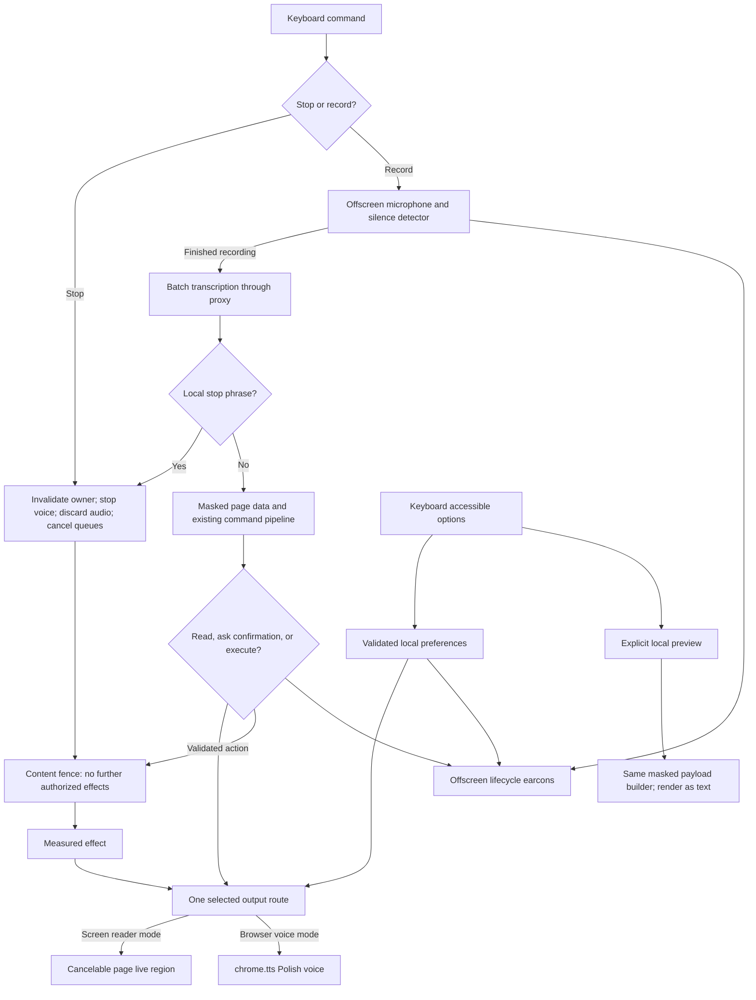

# Phase 04: Audio Control & Accessible Settings - Research

**Researched:** 2026-10-04
**Domain:** Chrome MV3 cancellation, mutually exclusive speech output, microphone lifecycle, accessible local settings
**Confidence:** MEDIUM — the research confidence seam returned MEDIUM for Context7 and officially cross-checked websearch; browser/audio acceptance remains untested.

## User Constraints

No phase CONTEXT.md was supplied. The user authorized research first without one and asked whether the `ms_tts` branch helps. No new user decisions are inferred here. Existing initialization decisions and requirements below remain binding. [VERIFIED: orchestrator task; `.planning/STATE.md:73-75`]

Existing decisions quote: `Extension in TypeScript (esbuild, MV3), proxy in Python (FastAPI + httpx); research mentions of plain JS and Hono are superseded`; `Fallback TTS is chrome.tts (pl-PL); primary output is the ARIA live region` (the source formats `chrome.tts` with Markdown backticks). [VERIFIED: `.planning/STATE.md:73-74`]

The requirements explicitly exclude `External TTS (ElevenLabs/Azure)` with reason `Screen reader is primary voice, chrome.tts is fallback`, and `Always-listening / wake word` with reason `Mic picks up screen reader speech`. Preserve those boundaries; Piper is not a replacement for required browser TTS in this phase. [VERIFIED: `.planning/REQUIREMENTS.md:93-95`, source uses Markdown backticks around `chrome.tts`]

## Summary

Use the existing extension architecture and platform APIs. The extension already declares `"tts"`, but normal output goes directly to a page live region and errors can bypass it through unconditional TTS. Page execution also announces directly in the content script. Therefore implement one output policy across background **and** content paths, rather than merely adding a TTS settings toggle. [VERIFIED: `extension/static/manifest.json:13-19`; `extension/src/background/pipeline.ts:55-85`; `extension/src/content/executor.ts:23-24`; `extension/src/content/index.ts:54-56`]

Cancellation is the central safety change. Current recording stop means finish-and-upload, while model cancellation exists only for stale replacement/closed-tab recovery. Reuse turn ownership and the final execution handshake, add an explicit discard path, and fence delayed content work and live-region writes. A keyboard stop can be immediate at handler entry; spoken stop cannot be recognized with a closed microphone or before the existing batch transcription returns. The phase must describe this limit honestly rather than claim continuous voice interruption. [VERIFIED: `extension/src/offscreen/offscreen.ts:45-68,114-122`; `extension/src/background/pipeline.ts:118-125,165-184,403-440,484-493`; `.planning/REQUIREMENTS.md:95`]

The fetched branch `origin/ms_tts` at `4af1e6a74de7fe3fa7eab735e088a69cc4822e43` adds a standalone Python TTS service and support files. `git diff --name-only HEAD...origin/ms_tts -- extension server` returned no paths. It helps as reference material for bounded audio requests and disconnect cleanup, but does not deliver Phase 4 extension features. Keep it separate now. [VERIFIED: `git rev-parse origin/ms_tts`, `git diff --stat HEAD...origin/ms_tts`, and scoped diff executed 2026-10-04]

**Primary recommendation:** Plan three coherent implementation slices: cancellation plus output routing; offscreen silence and earcons; accessible settings plus exact local request preview. Finish with explicit NVDA/Polish-voice acceptance.

## Architectural Responsibility Map

This is the recommended assignment, grounded in the existing ownership of requests, capture, page effects and settings. [VERIFIED: `extension/src/background/pipeline.ts:26-39,67-85,245-281`; `extension/src/offscreen/offscreen.ts:69-122`; `extension/src/content/index.ts:17-75`; `extension/src/options/options.ts:5-18`]

| Capability | Primary Tier | Secondary Tier | Rationale |
|------------|-------------|----------------|-----------|
| Stop command, turn invalidation, pending state | Extension service worker | Content and offscreen | Central owner rejects later work; each context cancels resources it owns |
| Batch STT cancellation, silence detection, earcons | Offscreen browser document | Worker | Recorder, stream, upload and Web Audio live together |
| Output mode and browser TTS | Extension service worker | Content | Worker selects one route; content owns only the selected live-region delivery |
| Cancel delayed clicks/fills/scrolls | Content script | Worker | Local cancellation fence complements the existing commit handshake |
| Persistent settings, accessible controls | Options document / browser storage | Worker | Only preferences persist; changes apply to later output safely |
| Masked snapshot and privacy preview | Content script | Worker and options document | Mask before crossing page boundary; show the shared request representation locally |
| Provider prompts and schema envelope | Existing API/backend | Extension preview explanation | Backend currently owns the full upstream envelope |

<phase_requirements>
## Phase Requirements

Descriptions are copied from the source, with provenance for each row. DATA_v7k9p2r4_START

| ID | Description | Research Support |
|----|-------------|------------------|
| `OUT-02` | User can switch the output mode to built-in voice (`chrome.tts`, pl-PL) when no screen reader is running; the two voices never speak at the same time | Single route, remove bypasses, inspect voice inventory; [VERIFIED: `.planning/REQUIREMENTS.md:23-23`] |
| `OUT-06` | User hears short, distinct earcons for "working", "done" and "needs confirmation", and can turn them off | Offscreen oscillator cues, lifecycle mapping, persisted Boolean; [VERIFIED: `.planning/REQUIREMENTS.md:27-27`] |
| `SAFE-05` | Barge-in: the stop shortcut (or "stop") immediately stops fallback speech, in-flight requests and pending actions | Urgent stop lane, owner invalidation, discard, delayed action fences; [VERIFIED: `.planning/REQUIREMENTS.md:53-53`] |
| `VOICE-04` | Recording auto-stops after a short silence | Time-domain silence detector with speech gate and existing hard cap; [VERIFIED: `.planning/REQUIREMENTS.md:17-17`] |
| `VOICE-05` | User hears an earcon when the mic opens and when it closes | Record actual start and stop events, including cancellation cleanup; [VERIFIED: `.planning/REQUIREMENTS.md:18-18`] |
| `SAFE-07` | User can open a local-only privacy preview showing exactly what would be sent to the model (off by default, nothing logged remotely) | Shared serialization, explicit local preview, no network side effects; [VERIFIED: `.planning/REQUIREMENTS.md:55-55`] |
| `A11Y-01` | Options page (mic grant, output mode, earcons on/off, verbosity, privacy preview) is fully operable by keyboard and screen reader, with proper labels, roles and focus order | Semantic native controls plus real NVDA acceptance; [VERIFIED: `.planning/REQUIREMENTS.md:71-71`] |
| `A11Y-02` | No state is conveyed only visually (color, icon, animation) | Text, programmatic control state and accessible status feedback; [VERIFIED: `.planning/REQUIREMENTS.md:72-72`] |

DATA_v7k9p2r4_END
</phase_requirements>

## Project Constraints

No root AGENTS.md was found in this session. The applicable project instruction file is `.claude/CLAUDE.md`, whose initialization overrides explicitly supersede older stack research. Project skill discovery found no local skill indexes. [VERIFIED: initial file inventory and existence check; `.claude/CLAUDE.md:13-36,273-275`]

- Use TypeScript with esbuild and no UI framework; keep Python in the FastAPI/httpx backend. Exact source wording: `Extension in TypeScript (esbuild build, no framework). Backend proxy in Python (FastAPI + httpx).` (source contains Markdown emphasis). [VERIFIED: `.claude/CLAUDE.md:18-18`]
- Code, technical comments and commits are English; user-facing UI and speech are Polish. [VERIFIED: `.claude/CLAUDE.md:15-15,35-35`]
- Add no dependency without a clear reason; keys belong only in backend environment variables; send minimal masked page data; the extension itself must work without mouse or sight. [VERIFIED: `.claude/CLAUDE.md:19-23`]
- Real screen-reader acceptance is required; semantic options controls are the established approach. [VERIFIED: `.claude/CLAUDE.md:77-77,212-212`]
- Keep edits within the authorized GSD workflow. [VERIFIED: `.claude/CLAUDE.md:282-289`]
- Config quotes: `"nyquist_validation": false`, `"security_enforcement": true`, `"security_asvs_level": 1`, `"human_verify_mode": "end-of-phase"`, `"commit_docs": true`. Consequently this file omits Validation Architecture, includes Security Domain and records human acceptance separately. [VERIFIED: `.planning/config.json:3-3,24-32,48-50`]

## Standard Stack

No new runtime package is needed. Retain the existing pinned tools rather than upgrading them during this phase. These package rows describe existing dependencies, not new install recommendations. The source declarations are `"@types/chrome": "0.3.4"`, `"@types/node": "26.6.4"`, `"esbuild": "0.28.2"`, `"typescript": "7.0.2"`. [VERIFIED: `extension/package.json:12-16`]

| Core | Version | Purpose | Evidence |
|------|---------|---------|----------|
| Chrome MV3 APIs | Existing minimum `"116"` | Commands, TTS, offscreen messaging, local/session storage | [VERIFIED: `extension/static/manifest.json:2-18`, quote `"minimum_chrome_version": "116"`] |
| Web Audio | Browser API | Analysis and short synthesized tones | [CITED: https://www.w3.org/TR/webaudio/] |
| TypeScript | Existing pin 7.0.2 | Shared typed messages/settings | [VERIFIED: `extension/package.json:16-16`; `npm view typescript@7.0.2 version`, publish date lookup 2026-07-08T15:55:18.431Z] |
| esbuild | Existing pin 0.28.2 | Existing packaged bundles | [VERIFIED: `extension/package.json:15-15`; `npm view esbuild@0.28.2 version`, publish date lookup 2026-08-08T20:00:55.454Z] |
| Node built-in test runner | Environment v26.8.2 | Existing unit tests and adapter mocks | [VERIFIED: `node --version`; `extension/package.json:9-9`, quote `"test": "node --test \"src/**/*.test.ts\" \"e2e/*.test.mjs\""`] |

Supporting: use native HTML labels, fieldsets, buttons, selects and checkboxes; no additional accessibility or VAD package. Native grouping/labeling is documented by WAI. [CITED: https://www.w3.org/WAI/tutorials/forms/labels/] [CITED: https://www.w3.org/WAI/tutorials/forms/grouping/]

**Installation:** None for Phase 4. Existing package registry lookups confirm those pinned versions exist; this research does not claim a package-legitimacy audit or recommend any new install. A future Piper integration would need its own package/model legitimacy checks before installing branch dependencies.

## Architecture Patterns

### System Architecture Diagram

Recommended flow; components correspond to the responsibility map above.



### Component Responsibilities and Actionable Files

Paths here identify inspected source files; proposed additions are explicitly labeled.

| Source / proposed addition | Planner task |
|----------------------------|--------------|
| `extension/static/manifest.json` | Add a distinct stop command beside existing `"toggle-listening"`; show actual bindings in options. [VERIFIED: lines 36-42] |
| `extension/src/background/index.ts` | Dispatch stop independently of an active tab; authenticate new options messages. Existing entrypoint handles `COMMAND_TOGGLE`. [VERIFIED: lines 1-13] |
| `extension/src/background/pipeline.ts` | Central stop path; pending cleanup; output router; owned terminal cues; preview dispatch. Existing seams: `runSerial`, `announce`, `speakTurn`, `ownsTurn`, `handleExecuting`. [VERIFIED: lines 67-85,110-136,229-242,484-493] |
| `extension/src/shared/protocol.ts` | Define and decode cancellation/preview messages, delivery acknowledgements and settings types. Quote current offscreen union: `{ target: 'offscreen'; type: 'REC_START'; turnId: string } | { target: 'offscreen'; type: 'REC_STOP'; turnId: string; stubText?: string }`. [VERIFIED: line 47] |
| `extension/src/shared/conversation.ts` | Add complete-phrase stop matching without matching dictated text containing the word. Existing normalization and full-phrase lookup are reusable. [VERIFIED: lines 20-30] |
| `extension/src/offscreen/offscreen.ts` | Expose discard without transcription, add analyzer and tone player, make all exits release resources. Existing `discard`, `release`, `stop` are separate functions. [VERIFIED: lines 14-29,62-68] |
| `extension/src/content/live-region.ts` | Cancel queue/drain by generation and settle discarded delivery promises. Existing delay sequence is `await sleep(60)` and `await sleep(300)`. [VERIFIED: lines 17-30] |
| `extension/src/content/index.ts`, `executor.ts` | Fence delayed scroll/action work; route pre-action lines via chosen output; acknowledge cancellation. Existing scroll and executor bypass background output. [VERIFIED: `index.ts:54-65`; `executor.ts:23-24,41-55`] |
| `extension/src/options/options.ts`, `extension/static/options.html` | Preserve microphone grant, add labeled settings/voice diagnostics/stop binding/explicit local preview. Existing button quote `id="grant-mic"`, status quote `id="mic-status" role="status" aria-live="polite"`. [VERIFIED: `options.html:8-11`; `options.ts:5-18`] |
| `extension/src/background/proxy.ts` and shared request builder (proposed) | Extract pure build/serialize/egress-check path for preview and real dispatch. Existing sequence: `const serialized = JSON.stringify(body); assertEgressClean(serialized);`. [VERIFIED: `proxy.ts:12-15`] |
| Existing pipeline/proxy tests and new offscreen/options/browser scenarios (proposed) | Exercise concurrency and boundary behavior using current Node/CDP harness. [VERIFIED: `extension/src/background/pipeline.test.ts:1-37`; `extension/e2e/smoke.mjs:8-14,29-44`] |

Generated bundle destinations must come from the build script, not invented source paths: `entryPoints: { 'background/sw': 'src/background/index.ts' }`; `'content/content': 'src/content/index.ts', 'offscreen/offscreen': 'src/offscreen/offscreen.ts', 'options/options': 'src/options/options.ts'`; the script creates `resolve(outdir, 'offscreen')` and `resolve(outdir, 'options')`, then copies their HTML. [VERIFIED: `extension/scripts/build.mjs:16-22`]

### Pattern 1: Urgent cancellation with persisted ownership

Use a stop entrypoint that immediately calls browser TTS stop, aborts known local controllers and sends best-effort discard/cancel messages, then serializes storage invalidation. Do not wait behind speech completion, page access preparation or a long microphone-open operation. Existing serialized toggle work includes asynchronous `preparePageAccess` and offscreen setup, so putting all stop work at the back of that same queue alone would delay silence. [VERIFIED: `extension/src/background/pipeline.ts:110-117,165-184`]

Clear all pending interaction and pending effect state even when the turn is already idle: confirmations survive between spoken turns. Current source quotes: `SESSION_KEYS = { turn: 'turn', pendingEffect: 'pendingEffect', pending: 'pending', lastResponse: 'lastResponse' }`; pending claims remove only the interaction key. [VERIFIED: `extension/src/shared/protocol.ts:5-5`; `extension/src/background/pipeline.ts:230-242`]

Use the stored owner/generation as the durable fence after worker restart, plus an immediate in-memory cancelled-owner fence for work already running. A stop from another tab addresses the current owner, not the shortcut tab. Suppress stale transcript, model response, catch fallback, wait timer, navigation effect and replay writes. Preserve ownership checks after every awaited operation. The current code already drops offscreen events when the stored turn is idle or has a different id, but some unconditional `speakTts` catch paths bypass this fence. [VERIFIED: `extension/src/background/pipeline.ts:193-202,229-242,460-464,495-541`]

Retain the final worker commit check and add local content cancellation before/after announcement delays and immediately before synchronous effect. The executor currently waits for an announcement, then 300 ms, then an asynchronous `commit()` before `element.click()` or native value write. Its scroll branch also awaits an announcement before moving. [VERIFIED: `extension/src/content/executor.ts:23-55`, quote `await new Promise(resolve => setTimeout(resolve, 300));` and `if (!(await commit())) return { ok: false, reason: 'unconfirmed' };`; `extension/src/content/index.ts:54-57`]

Define the execution commit point precisely: cancellation prevents effects not yet committed; it cannot undo an already performed synchronous DOM action. The worker's existing acknowledgement can race delivery of a stop to the content process. Tests must hold execution on both sides of this boundary and assert no new authorization once cancellation is registered; do not promise that past side effects are rolled back. This is a reasoning consequence of the inspected asynchronous handshake, not a measured browser timing guarantee. [VERIFIED: `extension/src/background/pipeline.ts:484-493`; `extension/src/content/executor.ts:41-55`]

### Pattern 2: One output selector, including content pre-announcements

Persist a validated output preference and earcon preference alongside the existing verbosity key; use one decoder shared by options and worker. Proposed defaults: screen-reader output and enabled earcons, with preview disabled. These defaults are design proposals, not locked user decisions. [ASSUMED: A1]

The exact existing verbosity contract is `VERBOSITY_KEY = 'verbosity'`, `VERBOSITY_LEVELS: readonly Verbosity[] = ['concise', 'standard', 'detailed']`, `DEFAULT_VERBOSITY: Verbosity = 'standard'`. Reuse this key and decoder; do not create a second settings value for speech detail. [VERIFIED: `extension/src/shared/protocol.ts:8-8`; `extension/src/shared/conversation.ts:34-41`]

Route each agent line to exactly one channel. Browser TTS must not also mutate the page live region, and screen-reader mode must not automatically start TTS after a send failure. Options native controls/status remain accessible regardless of selected website output; avoid having the browser voice narrate options statuses while NVDA also reads them. This replaces current unconditional transport-error fallback. [VERIFIED: `extension/src/background/pipeline.ts:65-75`; `extension/src/options/options.ts:9-12`; recommendation based on `OUT-02`]

On mode change, stop current browser speech and cancel existing agent live-region queues before subsequent output uses the new mode. Pass turn/document ownership with output work. Resolve cancelled queue items as cancelled delivery, not successful delivery, so they cannot update replay. A queue-clearing implementation must also protect the item fetched after the current 60 ms sleep; the present `queue.shift()!` assumes the queue was not cleared. [VERIFIED: `extension/src/content/live-region.ts:17-24`; `extension/src/background/pipeline.ts:76-85`]

Browser TTS stop clears its pending speech; speaking resolves before audible completion, so preserve sequence with an owned queue and terminal events. Query available voices, select Polish by language, handle missing voice/errors accessibly, and do not interpret voice inventory or `isSpeaking()` as screen-reader detection. The API also exposes whether a voice is remote, so do not claim browser TTS necessarily stays offline. [CITED: https://developer.chrome.com/docs/extensions/reference/api/tts]

Screen-reader output is controlled by assistive technology: ARIA conveys change priority and content, not an imperative speech-stop command. Clearing the agent live-region prevents later agent writes; it is not evidence that NVDA has stopped an utterance it already received. Use explicit output selection; manual tests must distinguish agent route exclusivity from independently speaking screen-reader UI. [CITED: https://www.w3.org/TR/wai-aria-1.2/#aria-live]

### Pattern 3: Recording completion and cancellation are different operations

Normal user toggle, silence and hard duration cap should finalize and upload once. Safety stop discards chunks and aborts the upload, and must never call the normal finalize-and-upload path. Existing capture discard sets `c.discarded = true; c.abort.abort(); void release(c);` and nulls recorder handlers before stopping it: reuse that mechanism rather than duplicating recorder cleanup. The opening race is already guarded after microphone acquisition. [VERIFIED: `extension/src/offscreen/offscreen.ts:23-29,45-68,75-76`]

Preserve the existing hard limit `RECORDING_CAP_MS = 25000`; silence detection supplements it. Use time-domain samples for an RMS-based gate; prevent silence before the first spoken sound from clipping a slow start, and bound the initial wait with the hard cap. A starting threshold, polling interval, minimum speech duration and trailing silence window must be tuneable pure-policy values tested against deterministic samples. Proposal: about 1.2 seconds of trailing silence after speech; the appropriate threshold and onset gate are unmeasured on the demo microphone. [VERIFIED: `extension/src/shared/limits.ts:4-4`] [CITED: https://www.w3.org/TR/webaudio/#dom-analysernode-getfloattimedomaindata] [ASSUMED: A2]

Apply analysis in both existing recording formats, quoted from source: `__AUDIO_FORMAT__ === 'wav'` and `mimeType: 'audio/webm;codecs=opus'`. Prefer an analyzer source disconnected from speakers; do not route microphone audio to audible destination. Clean detector timers, sources and analysis contexts on every exit, including opening failure, cancellation, normal stop and replaced turn. Existing WAV encoding uses its own context and processor, so shared cleanup must not close an earcon context mid-tone or remove WAV processing prematurely. [VERIFIED: `extension/src/offscreen/offscreen.ts:14-21,77-105`]

Use a timer suitable for a hidden document, rather than depending on visual animation frames. The actual hidden-context cadence and suspended AudioContext behavior are acceptance probes, not verified in this research. [ASSUMED: A3]

### Pattern 4: Earcons describe measured lifecycle transitions

Generate short tones in the offscreen context. Add audio playback to the actual offscreen reasons and retain the single-document creation guard. Chrome documents that `AUDIO_PLAYBACK` closes the document after 30 seconds without playback and only runtime extension messaging is exposed there. Recheck the document before each operation and handle closure/failure. Do not keep it alive by inaudible playback. [CITED: https://developer.chrome.com/docs/extensions/reference/api/offscreen]

Map mic-open to actual recorder start; mic-close to microphone release/normal stop/cancel exactly once; working to first processing transition; confirmation to a successfully stored pending interaction; done to successful terminal completion, not merely every reset or request arrival. Current events quote `type: 'MIC_OPEN'`, `type: 'REC_STOPPED'`, `type: 'TRANSCRIPT'`. They already carry immutable turn ids. [VERIFIED: `extension/src/shared/protocol.ts:46-54`; `extension/src/offscreen/offscreen.ts:46-49,85-99`; `extension/src/background/pipeline.ts:205-222,238-240`]

Make each cue a distinct bounded pattern with gain envelope and tracked sources. Cancellation stops queued/playing tones; if a mic-close cue is used after safety stop, it must not resurrect working/done cues. Cue failure must not strand a turn. When earcons are disabled, provide concise nonvisual lifecycle feedback through the selected output so disabling sound does not recreate silence. Keep confirmation questions and error next steps as words, even when their accompanying cue is enabled. Exact frequencies, durations and cue fallback wording are proposed usability choices pending listening tests. [ASSUMED: A4]

### Pattern 5: Exact local preview at the existing egress boundary

Reuse snapshot masking and `toModelText`, then the **same** pure request constructor, serialization and `assertEgressClean` as real dispatch. Current action request quotes `{ utterance, snapshot: toModelText(result.snapshot) }`, with utterance masked and capped by `Array.from(maskText(text)).slice(0, 500).join('')`. Exploration includes its mode, verbosity and candidates, and effects include action, diff and verbosity. A preview of a separately built DOM summary cannot establish equality. [VERIFIED: `extension/src/background/pipeline.ts:99-105,357-369,374-395,459-462`; `extension/src/background/proxy.ts:9-15`]

The preview is explicit, local and ephemeral: an options button requests an eligible page target, obtains a masked snapshot and renders bounded text with `textContent` or a readonly text control. Opening it must not record, transcribe, call a model, execute, log payloads or persist page text. Show target page, freshness and truncation; clear on hide, target navigation, tab removal and options close. Store at most a preview-enabled preference, not payloads. WAI status feedback should announce availability without reading the entire payload automatically. [VERIFIED: `extension/src/content/index.ts:30-39`; `extension/src/content/snapshot.ts:147-177,200-210`] [CITED: https://www.w3.org/WAI/WCAG22/Understanding/status-messages.html]

Preview must use a fixed requested tab/document, not query the currently active options tab after opening options. If the target lacks a receiver or its activeTab grant is no longer valid, report it and instruct an explicit command from the target tab; do not broaden host permissions. Taking another snapshot currently replaces the page id map and advances epoch, so preview during an active proposal/confirmation can invalidate that proposal. Either reject preview while busy/pending or introduce a truly read-only snapshot projection that does not publish targeting state. Prefer rejection for the small phase. [VERIFIED: `extension/src/background/pipeline.ts:53-63`; `extension/src/content/snapshot.ts:202-209`, quote `epoch = snapshot.epoch; idMap = nextMap; last = snapshot;`]

**Exactness boundary:** the extension sends a request body to the proxy; the proxy adds system/user messages, fences, schema, model and token configuration before sending to the model. Quote: `"model": settings.chat_model, "messages": messages`, `"response_format": {"type": "json_schema", "json_schema": ...}`. Do not label just the snapshot as the entire model payload. [VERIFIED: `server/app/prompts.py:35-40,56-61`; `server/app/exploration.py:104-111`; `server/app/openrouter.py:19-29`]

Recommended product scope: display the exact serialized **page-derived request data** the extension would send, explain in Polish that the proxy adds fixed instructions and response format, and test structural equality with the outgoing body. Show separate action/exploration examples only if their inputs are supplied; do not invent the user's next utterance or future effect diff. If literal full upstream-model-envelope preview is required, plan an additional generated/shared prompt/schema contract and equivalence tests against the Python builders; do not make a remote preview call or maintain a handwritten duplicate. This interpretation is a recommendation needing product confirmation before claiming full `SAFE-07` acceptance. [ASSUMED: A5]

### Accessible Options Pattern

Keep one semantic main, heading hierarchy, labeled native controls, a fieldset/legend for output radios, checkbox for earcons, labeled select for verbosity, explicit mic button and privacy show/hide button. Native state and Polish status text carry success/failure; preserve focus on save and put preview in normal keyboard reading order. Default tab order must follow DOM order. A save failure must restore/explain the prior effective preference. Labels and grouping follow WAI guidance. [CITED: https://www.w3.org/WAI/tutorials/forms/labels/] [CITED: https://www.w3.org/WAI/tutorials/forms/grouping/]

Show real toggle and stop shortcut assignments using `chrome.commands.getAll()`, including unassigned/colliding binding recovery. Commands require Ctrl or Alt (Shift is optional), and browser/OS shortcuts may take precedence; do not assume a suggested binding actually registered. Stop must work without successful page injection. [CITED: https://developer.chrome.com/docs/extensions/reference/api/commands]

### Anti-Patterns to Avoid

- Stop implemented as normal recording stop: that submits instead of discards. [VERIFIED: `extension/src/offscreen/offscreen.ts:62-68,99-104`]
- Updating only background announcements: page pre-action and scroll speech would still hit NVDA in browser-voice mode. [VERIFIED: `extension/src/content/executor.ts:23-24`; `extension/src/content/index.ts:54-56`]
- A successful DOM-write acknowledgement treated as proof of audible speech: the current acknowledgement is deliberately after mutation only. [VERIFIED: `extension/src/content/index.ts:25-28`]
- Cancelling network while allowing old catch blocks, queue sleeps or commit acknowledgements to resume output/effects. [VERIFIED: `extension/src/background/pipeline.ts:193-195`; `extension/src/content/live-region.ts:17-24`; `extension/src/content/executor.ts:41-47`]
- Preview that advances targeting epoch during a pending decision or triggers network just to show data. [VERIFIED: `extension/src/content/snapshot.ts:207-209`]

## Don't Hand-Roll

| Problem | Don't Build | Use Instead | Why |
|---------|-------------|-------------|-----|
| Polish synthesis in Phase 4 | PCM player, speech service deployment | Required Chrome TTS | Matches requirement and existing permission. [VERIFIED: `.planning/REQUIREMENTS.md:23-23`; `extension/static/manifest.json:18-18`] |
| Cancelling HTTP client work | Ad hoc response-ignore timers alone | Existing AbortController plus owner fence | Request signal already flows through shared proxy. [VERIFIED: `extension/src/background/proxy.ts:12-15`] |
| Accessible settings widgets | Custom radio/switch keyboard handling | Native HTML controls | WAI documented labels and grouping. [CITED: https://www.w3.org/WAI/tutorials/forms/grouping/] |
| Privacy representation | Second masker/snapshot implementation | Existing masked snapshot/formatter/egress assertion | Existing content pipeline already masks before boundary. [VERIFIED: `extension/src/content/snapshot.ts:147-177`; `extension/src/shared/snapshot-format.ts:21-37`; `extension/src/background/proxy.ts:9-15`] |
| Speech detail persistence | Another verbosity storage key | Existing validated enum/key | Same preference must govern both options and voice commands. [VERIFIED: `extension/src/shared/conversation.ts:34-41`; `extension/src/shared/protocol.ts:8-8`] |

## ms_tts Branch Assessment

**Inspection only:** source was read using `git show origin/ms_tts:<file>` at `4af1e6a74de7fe3fa7eab735e088a69cc4822e43` (`test: add streaming TTS playback and cancellation`). No branch was switched, merged or installed; branch tests, real Piper inference and remote TTS were not run. [VERIFIED: session git commands]

| Finding | Implication |
|---------|-------------|
| Local engine declares `media_type = "audio/pcm"`, `encoding = "pcm_s16le"`; conversion is `chunk.audio_int16_array.astype("<i2", copy=False).tobytes()`. [VERIFIED: `origin/ms_tts@4af1e6a:live_tts/local_engine.py:10-12,44-50`] | Raw PCM chunks need browser buffering/scheduling; they are not independently decodable MP3/WAV files. Reusing this now would add playback and cancellation work. |
| Endpoint aliases quote `"/synthesize/stream"`, `"/v1/synthesize/stream"`, `"/synthesize"`, `"/v1/synthesize"`; nonstreaming local response wraps PCM in WAV. [VERIFIED: `origin/ms_tts@4af1e6a:live_tts/server.py:94-117`] | A later adapter can choose chunked PCM or complete WAV, but neither is integrated with the extension. |
| Local cancellation shields a current thread task and awaits it before re-raising cancellation, then closes the iterator. Quote `await asyncio.shield(task)` in the cancellation shield. [VERIFIED: `origin/ms_tts@4af1e6a:live_tts/local_engine.py:53-68`] | Generation does not cease immediately. Browser stop must immediately stop scheduled playback and ignore late chunks; server cleanup may finish later. No latency number is established. |
| Server first-audio preparation holds a single busy slot; cleanup closes iterator and releases busy. [VERIFIED: `origin/ms_tts@4af1e6a:live_tts/server.py:65-86`] | Useful pattern for bounded requests and avoiding unbounded queues; not a replacement for turn fencing. |
| Stream response closes source under shield after disconnect, and telemetry logs counts/times/text length. [VERIFIED: `origin/ms_tts@4af1e6a:live_tts/streaming.py:37-81`] | Reviewable cleanup/metadata-only observability ideas; these are static code observations, not proven service behavior here. |
| Optional remote engine quotes `API_URL = "https://openrouter.ai/api/v1/audio/speech"`, `encoding = "mp3"`, and `"response_format": "mp3"`. [VERIFIED: `origin/ms_tts@4af1e6a:live_tts/remote_engine.py:4-10,29-41`] | Adds remote speech text egress and backend secrets. It does not satisfy the existing screen-reader/browser-TTS scope. |
| Defaults quote `backend: str = "local"`, `local_voice: str = "pl_PL-mc_speech-medium"`, `port: int = 7001`, `normalize_text: bool = False`; Python constraint quotes `requires-python = ">=3.12,<3.13"`. [VERIFIED: `origin/ms_tts@4af1e6a:live_tts/config.py:30-41`; `live_tts/pyproject.toml:5-5`] | Later adoption brings an extra runtime, model asset and service. Voice/model availability and quality were not checked. |
| Branch normalization is a Python function using a separate dependency; real-engine tests explicitly skip when the model is absent. [VERIFIED: `origin/ms_tts@4af1e6a:live_tts/text_normalizer.py:1-5,56-65`; `live_tts/tests/test_local_engine.py:8-10,30-32`] | Keep existing extension `speakable` and digit-group pipeline; do not replace it or claim real cancellation is tested because a test exists. |

**Reuse now:** reference the cancellation/cleanup/bounded-request principles and compare Polish pronunciation test cases; make no runtime integration or branch merge. **Later integration scope:** a separately approved third output adapter (or a browser TTS engine extension), model/service provisioning, host/origin and request-size guards, PCM/WAV playback cleanup, remote-data disclosure, local offline testing and full output-route regression. Keeping `chrome.tts` as the Phase 4 implementation is prescribed by the existing requirement; changing that requirement needs an explicit scope decision. [VERIFIED: `.planning/REQUIREMENTS.md:23-23,93-95`; branch inspection above]

## Runtime State Inventory

Included because output/settings work refactors existing runtime behavior. This research did not inspect the user's live Chrome profile or external services; unknown live state is not reported as absent.

| Category | Items Found / Observation | Action Required |
|----------|---------------------------|-----------------|
| Stored data | Session keys quote `'turn'`, `'pendingEffect'`, `'pending'`, `'lastResponse'`; durable verbosity quote `'verbosity'`. [VERIFIED: `extension/src/shared/protocol.ts:5-8`] | Code change: new settings decoder defaults preserve prior verbosity. Stop clears pending/session ownership. No destructive profile migration recommended. |
| Live service config | Existing capture directly calls proxy transcription; optional branch would add another service. [VERIFIED: `extension/src/offscreen/offscreen.ts:35-37`; branch assessment] | Keep existing proxy contract; deployment settings/remote state were not queried. No new service for this phase. |
| OS-registered state | Chrome command suggestion quote `"default": "Alt+Shift+A"`. Actual profile bindings and screen-reader keys not observed. [VERIFIED: `extension/static/manifest.json:37-41`] | Read actual bindings in options and manually test new stop shortcut on demo OS. |
| Secrets/env vars | Proxy URL is a build define: `__PROXY_URL__: JSON.stringify(proxy)`; remote branch requires backend key/model/voice. Secret values were not read. [VERIFIED: `extension/scripts/build.mjs:14-14`; `origin/ms_tts@4af1e6a:live_tts/remote_engine.py:19-26`] | No secret migration; do not expose keys in options or preview. |
| Build artifacts / installed packages | Build cleans only allowlisted `resolve(root, 'dist')`, `resolve(root, 'dist-e2e')` and writes bundle/HTML destinations above. [VERIFIED: `extension/scripts/build.mjs:9-25`] | Rebuild and reload existing unpacked extension; validate both recording formats. Installed global/OS TTS engines not observed. |

## Common Pitfalls

### Stop recognized too late

Current input is batch recording/upload, and toggle while processing returns `'busy'`; the intent union does not include stop. Quote `Intent = { kind: 'track_parcel'; rest: string } | { kind: 'yes' | 'no' | 'other' | 'captcha_request' }`. [VERIFIED: `extension/src/shared/turn.ts:21-25`; `extension/src/shared/intent.ts:2-12`]

Add local complete-phrase stop before pending claim/model routing and test that ordinary dictation containing stop is not intercepted. Explain that speech must be captured/transcribed to be recognized; the keyboard is the guaranteed immediate interruption path. Do not add continuous listening under the existing out-of-scope decision. This is a planning conflict to surface, not a claimed fulfillment of literal instantaneous spoken interruption. [VERIFIED: `.planning/REQUIREMENTS.md:95-95`; `extension/src/background/pipeline.ts:403-440`]

### Voice queue truncates the pre-action line

The current background TTS helper calls speak without sequencing; content's 300 ms delay is based on live-region mutation, not audio duration. For browser voice, wait for owned delivery/end for pre-action speech and keep stop outside that wait. Handle terminal interruption/error so the awaiting action cannot hang or act after cancellation. [VERIFIED: `extension/src/background/pipeline.ts:65-65`; `extension/src/content/executor.ts:23-24`] [CITED: https://developer.chrome.com/docs/extensions/reference/api/tts]

### Silence reacts to tone, background audio or initial hesitation

The existing media constraints ask for `echoCancellation: true, noiseSuppression: true`; that declaration is not proof they eliminate playback pickup. Avoid feedback to speakers, gate initial speech, retain hard cap and manually test headphones/speakers/background noise. [VERIFIED: `extension/src/offscreen/offscreen.ts:75-75`] [ASSUMED: A2]

### Preview changes the action it claims to inspect

Snapshot publication replaces targeting state. Busy/pending preview rejection and no-POST assertions are required. Masked text must be rendered as data, never HTML. [VERIFIED: `extension/src/content/snapshot.ts:202-209`] [CITED: https://raw.githubusercontent.com/OWASP/ASVS/v5.0.0/5.0/docs_en/OWASP_Application_Security_Verification_Standard_5.0.0_en.json]

## Code Examples

### Platform TTS control and analysis

These are platform-only examples, not proposed repository message/status enums. Polish locale is already used verbatim in `chrome.tts.speak(text, { lang: 'pl-PL', rate: 1.0 });`. [VERIFIED: `extension/src/background/pipeline.ts:65-65`]

```typescript
// Source: https://developer.chrome.com/docs/extensions/reference/api/tts
const voices = await chrome.tts.getVoices();
const voice = voices.find(v => v.lang?.toLowerCase() === 'pl-pl');
// Missing voice must be handled before invoking this branch.
if (voice) {
  await chrome.tts.speak(text, {
    lang: 'pl-PL', voiceName: voice.voiceName, enqueue: true,
    onEvent(event) { /* Handle terminal event and owner fence here. */ },
  }); // Acceptance only; this await is not audible completion.
}
chrome.tts.stop();
```

The normalized `'pl-pl'` comparison is example code derived from the documented language field and existing locale, not an in-repo enum. [CITED: https://developer.chrome.com/docs/extensions/reference/api/tts]

```typescript
// Source: https://www.w3.org/TR/webaudio/#dom-analysernode-getfloattimedomaindata
const source = context.createMediaStreamSource(stream);
const analyser = context.createAnalyser();
source.connect(analyser); // Do not connect microphone analysis to speakers.
const samples = new Float32Array(analyser.fftSize);
analyser.getFloatTimeDomainData(samples);
const rms = Math.sqrt(samples.reduce((sum, sample) => sum + sample * sample, 0) / samples.length);
// Feed rms + monotonic time into a pure onset/trailing-silence policy.
// Capture cleanup cancels its poller, disconnects graph and closes its owned context.
```

The RMS formula is a design derivation, not a tested microphone classifier. [ASSUMED: A2]

### Existing egress seam to extract, verbatim

DATA_d8m4q6z1_START
```typescript
const serialized = JSON.stringify(body);
assertEgressClean(serialized);
```
DATA_d8m4q6z1_END

Use this same serialized value in both local preview and real request; preserve rejection rather than hiding an unsafe payload by preview-only re-masking. [VERIFIED: `extension/src/background/proxy.ts:13-15`]

## State of the Art

| Existing / older approach | Required phase approach | Impact |
|---------------------------|-------------------------|--------|
| Unconditional live-region plus TTS on transport error | Explicit one-route output policy | Prevents dual agent speech. [VERIFIED: `extension/src/background/pipeline.ts:67-75`] |
| Recording hard cap only | Speech-gated silence plus same cap | Bounds both pauses and stuck sessions. [VERIFIED: `extension/src/offscreen/offscreen.ts:85-99`; proposed silence policy A2] |
| New snapshot constructed for preview without coordination | Shared request builder with read-only/busy guard | Avoids misleading payload and proposal invalidation. [VERIFIED: `extension/src/content/snapshot.ts:202-209`] |
| ASVS 4 category numbers in generic templates | ASVS 5.0.0 names/numbers below | Avoids mislabeled security mapping. [CITED: https://raw.githubusercontent.com/OWASP/ASVS/v5.0.0/5.0/docs_en/OWASP_Application_Security_Verification_Standard_5.0.0_en.json] |

No package upgrade or new speech service is recommended. Existing stack override supersedes old plain-JS/Hono suggestions. [VERIFIED: `.claude/CLAUDE.md:31-36`]

## Verification Guidance

Nyquist Validation Architecture is intentionally omitted because config explicitly disables it. Required implementation verification still belongs in plans. [VERIFIED: `.planning/config.json:24-24`, quote `"nyquist_validation": false`]

**Executed this session:** `npm test --prefix extension` exited 0: `tests 265`, `pass 265`, `fail 0`, `skipped 0`, duration `15609.38542` ms. `npm run typecheck --prefix extension` exited 0. These are baseline results only; no Phase 4 behavior or branch inference has been implemented/tested. [VERIFIED: test stdout captured 2026-10-04 in `/tmp/phase04-baseline-tests.log`; typecheck stdout/exit code]

| Requirement | Tests to add / extend |
|-------------|-----------------------|
| `SAFE-05` | Stop while mic opening/recording/uploading/model/delayed output/pre-action/navigation; duplicate stop; different-tab stop; idle confirmation clear; late success/error; worker restart; final commit race; stop never uploads discarded audio |
| `OUT-02` | Exactly one route for all output intents, content pre-action/scroll, unsupported-page errors and repeat; no replay write after cancelled delivery; switch mode during queued speech; missing voice and terminal TTS error |
| `VOICE-04` | Pure silence policy: initial quiet, short hesitation, voiced onset, trailing silence, sustained noise, hard cap; capture single finalization in WebM and WAV |
| `VOICE-05`, `OUT-06` | Five distinct cues, actual start/close timing, disabled cues with accessible lifecycle fallback, duplicate events, cancellation stops tones, recreation after document closure |
| `SAFE-07` | Preview serialization structurally equals outgoing body for same frozen inputs; secrets stay masked and parcel positive controls remain; no network/upload/model/effect/logging/persistent payload; preview target/nav/pending guards |
| `A11Y-01`, `A11Y-02` | Keyboard tab/shift-tab/space/arrow operation, label-role-state inspection, save failures, Polish feedback, preview readable without focus trap and without automatic full-payload speech |

Requirement ids above are source values from the Phase Requirements table. Use existing Node adapter tests and CDP scenario harness; new filenames are planner choices, not claims of existing tests. Current scripts quote `"typecheck": "tsc --noEmit"`, `"e2e": "node e2e/smoke.mjs"`, `"dom-check": "node e2e/dom-check.mjs"`. The harness selects scenarios by command arguments and runs fake upstream plus stub transcription. [VERIFIED: `extension/package.json:5-10`; `extension/e2e/smoke.mjs:8-14,29-44`]

Manual end-of-phase acceptance must include NVDA on Windows, keyboard-only options/mic grants, real stop binding, Polish TTS with screen reader off, selected-route behavior with NVDA on, distinct audible cues and silence using the demo microphone. Existing outstanding acceptance explicitly says `DOM write is not audible delivery` and tracks clean-profile mic/NVDA checks. Record outcomes, do not close prior acceptance items based on mocks. [VERIFIED: `.planning/WINDOWS.md:21-22,27-29`]

## Security Domain

Config requires security enforcement and level 1; the following mapping uses **ASVS 5.0.0**, not the old V2-authentication/V3-session template numbering. Applicability is scoped to this extension feature and does not assert full certification. [VERIFIED: `.planning/config.json:48-50`] [CITED: https://raw.githubusercontent.com/OWASP/ASVS/v5.0.0/5.0/docs_en/OWASP_Application_Security_Verification_Standard_5.0.0_en.json]

| ASVS category | Applies | Phase control |
|---------------|---------|---------------|
| V1 Encoding and Sanitization | Yes | Preview/page text rendered with text APIs; never HTML execution |
| V2 Validation and Business Logic | Yes | Strict settings/message decoding, owner/document fencing, bounded capture and preview |
| V3 Web Frontend Security | Yes | Packaged extension scripts; retain existing permission/CSP boundaries |
| V6 Authentication | No new login | Preserve sender-origin trust boundary; do not add keys to extension |
| V7 Session Management | No new user-auth session | Turn session state is operational; invalidate it on cancellation/restart safely |
| V8 Authorization | Yes | Trusted extension UI only for preview; no widening site grants or executing page-provided instructions |
| V11 Cryptography | No new algorithm | Keep backend secrets; use existing browser transport, no custom crypto |
| V14 Data Protection | Yes | Minimal masked preview, explicit local-only lifecycle; no query-string/body logs |
| V16 Security Logging and Error Handling | Yes | Fixed Polish safe failures; no preview/provider/speech bodies in logs |

Category labels are cited from the official versioned JSON above. Controls in this table are recommendations based on the phase's existing data/action boundaries. [CITED: https://raw.githubusercontent.com/OWASP/ASVS/v5.0.0/5.0/docs_en/OWASP_Application_Security_Verification_Standard_5.0.0_en.json]

| Threat pattern | STRIDE | Mitigation to verify |
|----------------|--------|----------------------|
| Forged options/preview message from a content context | Spoofing / Information disclosure | Check extension sender id AND trusted options URL/no tab sender; decode payload; never return preview to web content |
| Late action or output after stop | Tampering | Persisted owner invalidation + local cancellation + final commit fence |
| Preview executes page markup or leaks text | Tampering / Information disclosure | textContent/readonly plain text, existing masker and shared egress check, ephemeral local memory |
| Silence/cue resource leak or repeated audio event | Denial of service | Idempotent release, single capture owner, bounded timers/sources and existing duration cap |
| Unintended speech engine network egress | Information disclosure | Inspect remote voice metadata; disclose accurately, preserve selected output route |

These threat/control pairs are design analysis, grounded in existing sender checks, capture cleanup and proxy egress check rather than evidence of a newly exploited vulnerability. [VERIFIED: `extension/src/background/index.ts:6-13`; `extension/src/content/index.ts:17-18`; `extension/src/offscreen/offscreen.ts:14-29`; `extension/src/background/proxy.ts:9-15`] [CITED: https://developer.chrome.com/docs/extensions/reference/api/tts]

Client fetch abort is not proof the already-started provider computation/billing stopped: existing server action routes await an upstream request without observing a client-disconnect cancellation contract. Guarantee browser request abort and stale-result suppression; investigate proxy disconnect propagation separately if a stronger claim is desired. [VERIFIED: `server/app/main.py:71-107`; `server/app/openrouter.py:16-29`] [CITED: https://dom.spec.whatwg.org/#interface-abortcontroller]

## Environment Availability

| Dependency | Required By | Observation | Version / fallback |
|------------|-------------|-------------|--------------------|
| Node / npm | Unit tests and build | Available | v26.8.2 / 11.19.1. [VERIFIED: CLI probes] |
| Existing extension dependencies | Typecheck/build | Installed | Pins shown in Standard Stack; `npm ls --depth=0 --prefix extension` succeeded. [VERIFIED: CLI probe] |
| Chromium | CDP verification | Available | `Chromium 152.0.7977.82 Arch Linux`. [VERIFIED: `chromium --version`] |
| uv | Existing fake-proxy harness | Available | `uv 0.12.20`. [VERIFIED: CLI probe] |
| Polish Chrome voice | Audible output acceptance | Not observed | Query getVoices in the actual extension/demo machine; retain accessible unavailable-state feedback |
| NVDA / Windows demo machine | Actual audible/accessibility acceptance | Not exercised in this Linux session | Schedule human end-of-phase check; CDP only verifies structure/mutations |
| Real microphone and audio hardware | Silence/earcons | Not exercised | Deterministic unit inputs are supplemental; actual listening test remains required |
| Piper model/service | Optional future branch work | Not provisioned/tested for this research | Not required for Phase 4 |

No missing dependency blocks writing the implementation plan. Audible acceptance requires target hardware and screen-reader access; this research cannot infer their availability from the Linux test runner. [VERIFIED: baseline test/probe outputs and `.planning/WINDOWS.md:21-29`]

## Assumptions Log

| # | Claim / proposed decision | Section | Risk if Wrong |
|---|----------------------------|---------|---------------|
| A1 | Default screen-reader mode, enabled earcons, preview off; output/earcon setting names not yet chosen | Output selector | Wrong usability default; keep configurable and confirm before locking |
| A2 | Roughly 1.2 s trailing silence plus RMS/onset policy suits target microphone | Recording / pitfalls / code | Early clipping or failure to stop; tune from real Polish speech/noise |
| A3 | Hidden-document timer cadence and AudioContext behavior meet detector/cue timing | Recording | Delayed auto-stop/cues; prove with browser/hardware |
| A4 | Proposed cue patterns and disabled-earcon verbal feedback are distinguishable/useful | Earcons | Confusion or unwanted chatter; listening acceptance needed |
| A5 | Exact page-derived request preview plus explanation satisfies intended SAFE-07, rather than complete backend-added envelope | Privacy preview | Acceptance mismatch; clarify wording or plan generated shared envelope |

## Open Questions

1. **Literal spoken interruption:** Existing push-to-talk/batch STT and explicit exclusion of always-listening conflict with instantaneous spoken stop while busy. Recommend guaranteed keyboard stop and locally recognized stop within captured turns; record the spoken latency limit. If immediate spoken interruption during processing is mandatory, it requires a separate authorized input design and scope decision. [VERIFIED: `.planning/REQUIREMENTS.md:53-53,95-95`; `extension/src/shared/turn.ts:21-25`; `extension/src/offscreen/offscreen.ts:45-68`]
2. **Privacy preview exactness:** Confirm whether page-derived outbound data plus disclosure is the intended acceptance surface. Full upstream envelope requires sharing/generated contracts across TypeScript and Python; do not silently weaken the word "exactly". [ASSUMED: A5]
3. **Target voice/hardware:** Actual voice availability, remote flag, clean-profile grant, NVDA announcements and usable silence thresholds remain unmeasured. Include executable probes and human acceptance, not a blocker to planning. [VERIFIED: environment audit and existing `.planning/WINDOWS.md:21-29`]

## Sources

### Primary sources

- Existing sources cited inline, opened this session with numbered complete/relevant file reads; branch code pinned to the full fetched commit above. Static analysis establishes code structure, not runtime/audio performance.
- [Chrome TTS API](https://developer.chrome.com/docs/extensions/reference/api/tts) — Context7 and direct official lookup; sequencing, stop, voice metadata.
- [Chrome Commands API](https://developer.chrome.com/docs/extensions/reference/api/commands) — shortcuts and collisions; page reports last updated 2026-09-11.
- [Chrome Offscreen API](https://developer.chrome.com/docs/extensions/reference/api/offscreen) — reasons, API boundary and lifetime; Context7 plus direct official cross-check.
- [Web Audio specification](https://www.w3.org/TR/webaudio/) — analysis graph and time-domain samples.
- [WAI labels](https://www.w3.org/WAI/tutorials/forms/labels/), [grouping](https://www.w3.org/WAI/tutorials/forms/grouping/), [status messages](https://www.w3.org/WAI/WCAG22/Understanding/status-messages.html), [ARIA live](https://www.w3.org/TR/wai-aria-1.2/#aria-live) — accessibility semantics, not proof of NVDA speech in this app.
- [Official ASVS 5.0.0 JSON](https://raw.githubusercontent.com/OWASP/ASVS/v5.0.0/5.0/docs_en/OWASP_Application_Security_Verification_Standard_5.0.0_en.json) — category names and relevant control families.
- [DOM AbortController](https://dom.spec.whatwg.org/#interface-abortcontroller) — client-side abort semantics.

### Confidence provenance

The research-plan seam selected Context7 for both Chrome questions and websearch for accessibility/security. Context7 library `/websites/developer_chrome_extensions_reference_api` was resolved then queried. The `classify-confidence --provider context7 --verified` and `--provider websearch --verified` results were both `"confidence": "MEDIUM"`; all three digests were cached with that tier. No unjustified package-OK upgrade was applied. Directly read repository claims use checkable VERIFIED tags; the overall evidence tier remains MEDIUM. [VERIFIED: seam outputs executed 2026-10-04]

### Unverified proposals

Only A1–A5 are assumed decisions/behavior. No paid provider calls, downloaded voice model or branch test execution was used.

## Metadata

**Confidence breakdown:** Standard stack MEDIUM (official platform sources and existing pins); architecture MEDIUM (source-grounded recommendations, concurrency changes unimplemented); pitfalls MEDIUM (specific inspected races, acoustic behavior pending).

**Research date:** 2026-10-04
**Valid until:** Recheck at implementation and target-machine acceptance; source observations become stale when cited files/branch head change. Platform guidance review suggested within 30 days; numeric acoustic defaults remain provisional.
