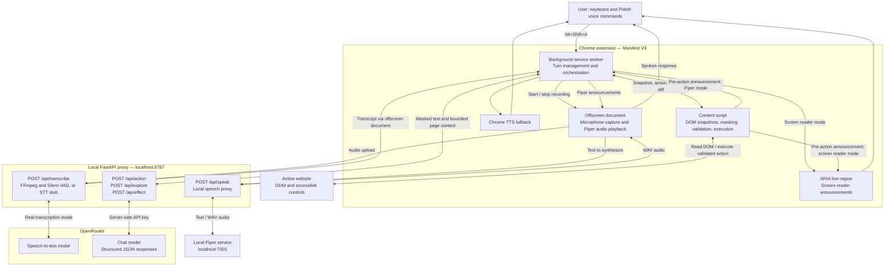

# FastEcho

FastEcho is a general-purpose Chrome extension that helps blind and visually impaired users interact with websites through Polish voice commands. Built for HackYeah 2026, it can describe a page, suggest available actions, click controls, fill ordinary form fields, scroll, and report the observed result through a screen reader or a local Piper voice.

The core browsing workflow works with the active website's DOM and accessible labels. The repository includes local HTML fixtures for repeatable demonstrations and tests. User-facing commands and announcements are in Polish; this documentation is in English.

## Features

- **Keyboard-operated voice input:** press `Alt+Shift+A` to start recording and press it again to submit a command.
- **Page exploration:** ask what is on the page or what actions are available.
- **Validated browser actions:** model proposals are checked against the current page before execution.
- **Result feedback:** compare page state before and after an action and announce the observed change.
- **Selectable spoken output:** use your screen reader through an ARIA live region or let local Piper read FastEcho's responses. Chrome TTS provides fallback speech when Piper is unavailable.
- **Conversation controls:** repeat the last response, adjust response detail, and answer clarification or confirmation questions.
- **Sensitive-field protection:** mask recognized sensitive data in page snapshots and refuse actions on protected fields or CAPTCHA controls.

## Architecture



The model proposes an action; the extension controls whether it can execute. It validates the target, detects stale page state, asks for clarification when necessary, and requests confirmation for recognized irreversible actions or consent controls. After execution, it observes DOM changes and produces an outcome announcement.

**`live_stt/` is a separate, optional WebSocket transcription service.** It supports OpenRouter and local NeMo Parakeet backends. The Chrome extension currently uses `/api/transcribe` on the main backend and does not connect to this WebSocket service.

## Repository layout

```text
extension/
  src/background/       Service worker, API client, and command pipeline
  src/content/          Page snapshots, action execution, and ARIA feedback
  src/offscreen/        Microphone recording, transcription upload, speech playback
  src/options/          Microphone permission and shortcut settings
  src/shared/           Protocols, masking, validation, and Polish commands
  static/               Manifest and HTML templates
  e2e/                  Chromium integration tests and live website checks
server/
  app/                  FastAPI proxy, model requests, and audio processing
  fixtures/             Local demo pages
  tests/                Backend tests and a fake OpenRouter server
  .env.example          Backend configuration template
live_stt/               Independent WebSocket ASR service and Docker setup
live_tts/               Local Piper speech synthesis service and voice setup
tests/                  Test plans and reports
CLAUDE.md               Project goals and team guidelines
```

## Requirements

For the extension and main backend:

- Chrome **116 or newer**, with support for loading unpacked extensions.
- Node.js **22.18 or newer** and npm. Tests execute TypeScript directly using Node's built-in type stripping.
- Python **3.12 or newer** and `uv`.
- **FFmpeg** on `PATH` for real audio transcription.
- An **OpenRouter API key** with access to the configured chat and transcription models for the full voice workflow.
- A microphone, plus either a screen reader with ARIA live-region support (such as NVDA or VoiceOver) or the optional local Piper service below for spoken feedback.

The main backend runs Silero VAD locally on CPU; it does not require a GPU. Docker is only needed if you choose the optional containerized `live_stt` service.

## Quick start

The commands below assume a POSIX shell and start from the repository root. On Windows, use `Copy-Item` in PowerShell instead of `cp`.

### 1. Configure and start the backend

```sh
cd server
uv sync --locked
cp .env.example .env
```

If `.env` already exists, edit it rather than replacing it. Set these values in `server/.env`:

```dotenv
OPENROUTER_API_KEY=your-openrouter-api-key
CHAT_MODEL=anthropic/claude-sonnet-5.5
STT_MODE=whisper
STT_MODEL=openai/whisper-large-v3-turbo
```

The model identifiers above are the defaults configured in this repository. Override them with compatible models available to your OpenRouter account if needed.

Start the server from `server/`:

```sh
uv run --locked uvicorn app.main:create_app --factory --host 127.0.0.1 --port 8787 --no-access-log
```

In another terminal, check readiness:

```sh
curl http://localhost:8787/health
```

Expected response: `{"ok":true}`. This checks the local HTTP service; it does not verify your API key, account balance, or model access. The backend loads `server/.env` automatically and does not expose Swagger or OpenAPI routes.

### 2. Build the extension

In a new terminal, from the repository root:

```sh
cd extension
npm ci
npm run build
```

The build generates `extension/dist/` and uses `http://localhost:8787` as the proxy URL by default.

### 3. Load it in Chrome

1. Open `chrome://extensions` and enable **Developer mode**.
2. Choose **Load unpacked** and select `extension/dist/`.
3. The extension's options page opens on first installation. Choose **Włącz mikrofon** (Enable microphone) and allow microphone access.
4. Check the assigned shortcut at `chrome://extensions/shortcuts`; the default is `Alt+Shift+A`.
5. In extension options, choose **Czytnik ekranu** (Screen reader) or **Piper – lokalny głos FastEcho** and choose **Zapisz wybór głosu** (Save voice choice). Screen reader mode is the default. For Piper, follow [Local Piper voice](#local-piper-voice) and use **Przetestuj głos Pipera** (Test Piper voice).
6. Open an ordinary HTTP(S) website and issue a voice command. You can also use the local demo below.

After changing extension code or build settings, rebuild and reload the extension in `chrome://extensions`. Reload the website too so it receives the updated content script.

### 4. Try a local demo page

Open:

```text
http://localhost:8787/fixtures/tracking-form.html
```

Press `Alt+Shift+A`, say a command in Polish, and press the shortcut again to submit it. Recording automatically ends after **25 seconds**.

| Polish command | Purpose |
| --- | --- |
| `Co tu jest?` | Summarize the current page. |
| `Co mogę zrobić?` | List available actions. |
| `Sprawdź status przesyłki` | Start the parcel-tracking conversation. |
| `Kliknij Znajdź` | Request a click on a named control. |
| `Przewiń w dół` / `Przewiń w górę` | Scroll the page. |
| `Na górę strony` | Return to the top. |
| `Powtórz` | Repeat the last delivered response for the current page. |
| `Krócej` / `Dokładniej` | Adjust response detail. |
| `Tak` / `Nie` | Confirm or decline a pending action. |

For a fixture-only parcel demo, start tracking, provide `12345678` when asked for the parcel number, and confirm the read-back with `Tak`. The fixture simulates a tracking result locally.

### Transcription stub mode

For a microphone and pipeline check without a paid transcription call, use:

```dotenv
STT_MODE=stub
STT_STUB_TEXT=kliknij Znajdź
```

Restart the backend after changing settings. Stub mode returns the configured text regardless of the recording. **It replaces speech recognition only:** commands that use chat-model endpoints still require an OpenRouter key. The automated E2E suite supplies a fake upstream for tests without paid API calls.

## Configuration

### Main backend: `server/.env`

| Variable | Default / behavior |
| --- | --- |
| `OPENROUTER_API_KEY` | Required for model-backed actions, exploration, effects, and real transcription. |
| `CHAT_MODEL` | `anthropic/claude-sonnet-5.5`; use a fixed compatible model identifier. |
| `OPENROUTER_BASE_URL` | `https://openrouter.ai/api/v1`. |
| `OPENROUTER_TIMEOUT_S` | `15` seconds for chat requests. |
| `STT_MODE` | `stub`; set `whisper` for real transcription through OpenRouter. |
| `STT_MODEL` | `openai/whisper-large-v3-turbo`; selects the real transcription model. |
| `STT_STUB_TEXT` | `kliknij Znajdź`. |
| `STT_AUDIO_DEBUG_DIR` | Disabled when empty; optionally saves outgoing processed WAV audio locally. |
| `MAX_BODY_BYTES` | `2097152` (2 MiB). |
| `EXTENSION_ID` | Derived from the key in `extension/static/manifest.json` unless explicitly set. |
| `ALLOWED_HOSTS` | Additional comma-separated hosts; `localhost` and `127.0.0.1` are always included. |
| `WARMUP_ON_START` | Disabled; `1` or `true` enables startup warm-up requests when a key is configured. |
| `TTS_BASE_URL` | `http://127.0.0.1:7001`; local Piper service used by `/api/speak`. |

Real transcription decodes audio with FFmpeg, detects speech with Silero VAD, and sends processed mono 16 kHz WAV audio to OpenRouter. Despite the name `STT_MODE=whisper`, `STT_MODEL` may select another compatible transcription model.

### Extension build settings

These values are embedded during the build:

```sh
cd extension
PROXY_URL=http://localhost:8787 AUDIO_FORMAT=wav npm run build
```

- `PROXY_URL`: backend URL; also determines proxy host permissions and fixture matching in the generated manifest.
- `AUDIO_FORMAT`: `webm` (default, Opus) or `wav` (PCM16, mono, 16 kHz).

For PowerShell, set `$env:PROXY_URL` and `$env:AUDIO_FORMAT` before running `npm run build`.

## Backend API

| Method | Path | Purpose |
| --- | --- | --- |
| `GET` | `/health` | Local service health check. |
| `POST` | `/api/transcribe` | Accept an audio body with an `audio/*` content type and return `{"text":"..."}`. |
| `POST` | `/api/speak` | Accept `{"text":"..."}` and return mono PCM16 WAV audio from the local Piper service. No OpenRouter key is needed for local synthesis. |
| `POST` | `/api/action` | Propose a structured action from an utterance and page snapshot. |
| `POST` | `/api/explore` | Generate a page summary or select available action candidates. |
| `POST` | `/api/effect` | Summarize an executed action and observed page diff. |
| `GET` | `/fixtures/<filename>.html` | Serve local demo and test pages. |

Request and response contracts are defined in [server/app/schemas.py](server/app/schemas.py), [server/app/exploration.py](server/app/exploration.py), and [extension/src/shared/protocol.ts](extension/src/shared/protocol.ts). Browser-origin requests are restricted to the configured extension origin.

## Privacy and action safety

- API keys stay in the backend environment, outside the extension bundle.
- Page context uses bounded DOM-derived snapshots rather than screenshots or full HTML.
- Recognized sensitive fields and supported identifier patterns are masked before text context is sent to model endpoints. An additional egress check blocks text payloads that still contain recognized sensitive patterns.
- The executor refuses protected password, payment-code, and other sensitive fields, as well as recognized CAPTCHA targets.
- Confirmation and target validation happen locally, including a fresh check immediately before a side effect.
- Backend access logs record paths, statuses, and timings rather than request bodies or transcripts. Audio debug copies are opt-in.

**Audio is a separate data path:** in real transcription mode, recorded speech is sent to OpenRouter before transcript masking. Avoid dictating passwords or other secrets. Local masking is a defensive heuristic, not a guarantee that every sensitive value or dangerous control can be recognized on every website.

## Development and tests

Run extension checks from `extension/`:

```sh
npm run typecheck
npm test
npm run build
```

Run backend tests from `server/`:

```sh
uv run --locked pytest -q
```

For browser integration tests, install Chromium and ensure `uv` and Node.js are on `PATH`. From `extension/`:

```sh
npm run dom-check
npm run e2e
```

The E2E runner builds into `dist-e2e/`, launches an isolated browser with a fake microphone, and starts a test proxy and fake OpenRouter on ports **8788** and **8799**. It does not require a real API key. Set `CHROMIUM_BIN` to the browser executable if it is not named `chromium`; use `HEADFUL=1` to show the test browser.

See [the test report](tests/REPORT.md) for test scope and recorded results.

## Local Piper voice

Piper reads FastEcho's descriptions, action announcements, confirmations, and results without requiring a screen reader. Speech synthesis runs locally on CPU. The main backend forwards text to the Piper service, and the extension plays its WAV response in an offscreen document.

### 1. Prepare Piper once

From the repository root:

```sh
cd live_tts
uv sync --locked
cp config.env.example config.env
```

If `config.env` already exists, retain your settings. For local use, set:

```dotenv
TTS_BACKEND=local
TTS_HOST=127.0.0.1
TTS_PORT=7001
TTS_LOCAL_VOICE=pl_PL-mc_speech-medium
```

This service uses its own Python 3.12 environment; `uv` installs the interpreter if needed. The first setup downloads the Polish voice. Voice files and local configuration are ignored by Git.

After saving `config.env`, download the voice from `live_tts/`:

```sh
uv run --locked scripts/download_model.py
```

### 2. Start both services

Keep these processes running in **two separate terminals**. Each command block starts from the repository root.

**Terminal 1 — Piper:**

```sh
cd live_tts
uv run --locked run.py
```

**Terminal 2 — main FastAPI backend:**

```sh
cd server
uv run --locked uvicorn app.main:create_app --factory --host 127.0.0.1 --port 8787 --no-access-log
```

Prepare `server/.env` and install backend dependencies as described in [Quick start](#quick-start). The backend uses `TTS_BASE_URL=http://127.0.0.1:7001` by default. If Piper runs on another address or port, set `TTS_BASE_URL` in `server/.env` and restart the backend.

| Component | Default address | Role |
| --- | --- | --- |
| Main backend | `http://localhost:8787` | Transcription, page reasoning, and forwarding speech requests. |
| Piper | `http://127.0.0.1:7001` | Local text-to-speech synthesis. |
| Chrome extension | Loaded from `extension/dist/` | Microphone input, browser actions, and audio playback. |

Local Piper synthesis requires no API key. Speech recognition in `STT_MODE=whisper` and model-backed page features still require OpenRouter configuration. Piper generates the spoken response; it does not transcribe microphone input or inspect the page.

### 3. Enable Piper in Chrome

In a third terminal, build the extension from the repository root:

```sh
cd extension
npm ci
npm run build
```

1. Open `chrome://extensions`. Load `extension/dist/` as an unpacked extension, or reload the existing FastEcho extension.
2. Open FastEcho's **Extension options**.
3. Choose **Piper – lokalny głos FastEcho** under **Głos odpowiedzi** (Response voice).
4. Click **Zapisz wybór głosu** (Save voice choice).
5. Click **Przetestuj głos Pipera** (Test Piper voice). You should hear a Polish greeting, followed by the status **Test głosu zakończony.** (Voice test completed).
6. Grant microphone access with **Włącz mikrofon** if needed, then reload the website you want to use.
7. Press `Alt+Shift+A`, say **Co tu jest?**, and press `Alt+Shift+A` again to submit the command. FastEcho will speak the page summary using Piper.

The selected output mode persists between browser sessions. On subsequent starts, launch the two services and use the extension; dependency installation and voice download are only needed during setup or updates. Stop either local service with `Ctrl+C` in its terminal.

### 4. Verify the setup

From another terminal, check both services:

```sh
curl http://localhost:8787/health
curl http://127.0.0.1:7001/health
```

The main backend should return `{"ok":true}`. Piper should report `"ready": true`, `"backend": "local"`, and the configured voice. Neither health check verifies OpenRouter credentials.

To test the backend-to-Piper connection directly and save a WAV file:

```sh
curl --fail http://localhost:8787/api/speak \
  -H 'Content-Type: application/json' \
  -d '{"text":"Dzień dobry. Tu FastEcho."}' \
  -o fastecho-voice-test.wav
```

On Windows PowerShell, use `curl.exe` for these curl commands and place the synthesis command on one line. Play the resulting WAV with your audio player; delete it after testing if no longer needed.

Spoken messages are queued. The shortcut interrupts playback before a new recording, and the listening cue finishes before the microphone opens. Piper mode does not also send the same messages to the page's ARIA live region. If synthesis or playback fails, FastEcho announces the failure and uses Chrome TTS; Chrome must have a working speech voice for this fallback to be audible.

Run the Piper service tests from `live_tts/`:

```sh
uv run --locked pytest -q
```

Detailed voice settings and the standalone streaming API are documented in [live_tts/README.md](live_tts/README.md). The extension currently uses completed WAV responses rather than the streaming endpoint.

## Optional WebSocket ASR service

`live_stt/` can serve other audio clients independently of the Chrome extension. Its API uses Python **3.14.7**; the local NeMo worker uses a separate Python **3.13.15** environment. The launcher requires `uv >= 0.12.19` and Docker with Linux containers.

```sh
cd live_stt
cp env.example config.env
# Edit config.env: choose ASR_BACKEND and configure the selected backend.
uv run --locked --no-dev run.py start
uv run --locked --no-dev run.py logs
```

Connect a compatible PCM16, 16 kHz, mono audio client to `ws://127.0.0.1:7000/v1/transcribe`. Choose `ASR_BACKEND=openrouter` with an API key, or `ASR_BACKEND=local` with NeMo Parakeet and `DEVICE=cpu` or `cuda`. CUDA requires an NVIDIA GPU exposed to Docker.

Stop the service with `uv run --locked --no-dev run.py stop`. The default Compose configuration publishes port 7000 on all interfaces and has no client authentication; bind it to loopback for a local-only setup.

Detailed configuration, protocol, and runtime requirements are documented in [live_stt/README.md](live_stt/README.md).

## Troubleshooting

| Symptom | Check |
| --- | --- |
| Shortcut does nothing | Check `chrome://extensions/shortcuts` for conflicts or an unassigned command. |
| Microphone cannot start | Open extension options, grant microphone access, and check OS microphone permissions. |
| No spoken response on the page | Check the selected voice in extension options. In screen reader mode, enable your reader and its live-region announcements. In Piper mode, run the voice test. |
| Piper is unavailable | Check `http://127.0.0.1:7001/health`, the main backend, `TTS_BASE_URL`, and the downloaded voice files. |
| Every recording produces the same command | Set `STT_MODE=whisper` instead of `stub` and restart the backend. |
| Backend reports `no_api_key` | Set `OPENROUTER_API_KEY` in `server/.env` and restart. |
| Real transcription fails | Check FFmpeg on `PATH`, API credentials, model access, and backend logs. |
| Extension cannot reach the backend | Check `/health` and the build-time `PROXY_URL`; rebuild and reload after changing it. |
| Requests are rejected with `forbidden_origin` | Check that the loaded extension's ID matches the backend configuration and manifest key. |
| A page is unsupported | Browser-internal pages and extension stores cannot be automated. Use an ordinary HTTP(S) page. |
| Chromium tests cannot launch | Set `CHROMIUM_BIN` to a compatible executable and ensure ports 8788 and 8799 are free. |

## Scope and limitations

FastEcho is a general-purpose browsing assistant with Polish voice interaction. On ordinary HTTP(S) websites, pressing the shortcut grants access to the active tab and injects the content script when needed.

This hackathon prototype executes actions in the top-level document. Compatibility depends on each site's DOM and accessible labels, so behavior may vary between websites.

The main extension uploads a completed recording rather than streaming audio. Cloud-backed features require network access and may incur provider charges. Dynamic page changes, third-party widgets, and model errors can interrupt a command; announcements report observed page changes rather than independently verifying a transaction with the external service.

For further implementation details, see [the backend audio documentation](server/README.md) and [the project guidelines](CLAUDE.md).
